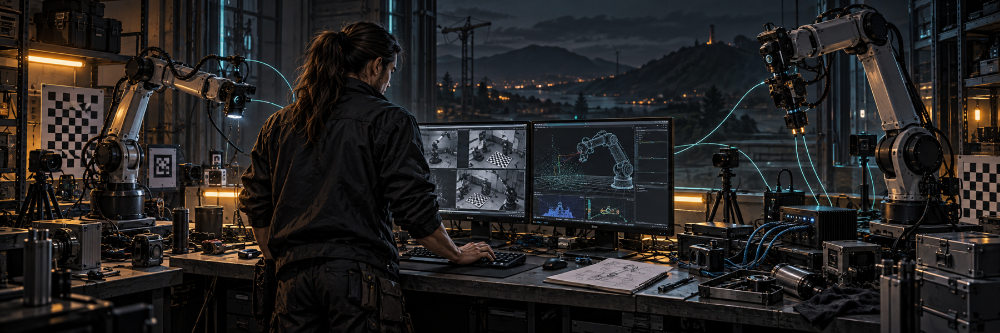
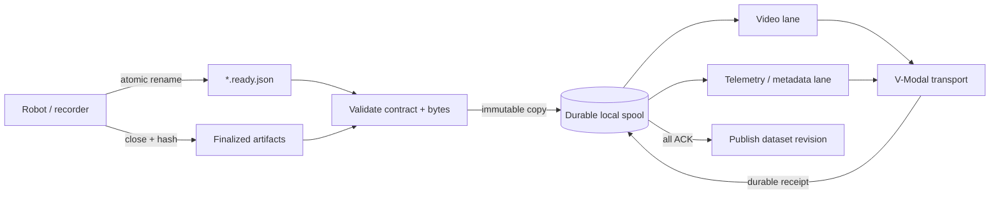

<div align="center">

# V-Modal Robotics

### Robot data should survive reality.

**Power cuts · Network loss · Full disks · Partial uploads · 3 a.m. restarts**

[](https://github.com/v-modal/vmodal_sdk_robotics/tree/main/lerobot)
[](https://github.com/v-modal/vmodal_sdk_robotics/tree/main/lerobot)
[](https://github.com/v-modal/vmodal_sdk_robotics)
[](https://github.com/v-modal/vmodal_sdk_robotics/blob/main/lerobot/LICENSE)
[](https://v-modal.github.io/vmodal_sdk_robotics/)

</div>



V-Modal Robotics is the hard edge between a robot that produces valuable data
and a network that cannot be trusted. It gives robotics developers a small,
auditable path from finalized sensor artifacts to durable remote storage—without
putting cloud behavior inside the control loop.

No giant runtime. No database server. No assumption that Wi-Fi, power, or the
process will still exist one second from now.

> The robot keeps working. The spool remembers. The uploader catches up.

## Install in one prompt

Paste this into Codex, Claude Code, or your preferred coding agent from the
robot application repository:

```text
Install and configure the V-Modal Robotics LeRobot SDK in this project.

Repository:
https://github.com/v-modal/vmodal_sdk_robotics/tree/main/lerobot

Requirements:
1. Inspect this repository first and identify its Python environment, dependency
   files, LeRobot dataset output directory, service manager, configuration
   conventions, and existing tests. Preserve the current environment and package
   manager; do not create a new virtual environment unless the project already
   requires one.
2. Install the tagged package from the public repository using:
   vmodal-robotics[vmodal] @ git+https://github.com/v-modal/vmodal_sdk_robotics.git@v0.1.0#subdirectory=lerobot
   Add it to the project's existing dependency file with an exact tag. Do not
   install from an unpinned main branch.
3. Configure a persistent spool directory outside temporary storage. Use
   /var/lib/vmodal-robot by default, or select the repository's established
   persistent data location when one exists. Configure the ready-manifest input
   directory beside the finalized LeRobot dataset output.
4. Add the required VMODAL_* configuration through the project's existing
   environment or secrets mechanism. Never commit credentials, tokens, local
   .env files, generated datasets, or spool contents.
5. Integrate only at the finalized-artifact boundary. Do not put uploads,
   network calls, hashing, or cloud acknowledgments inside the robot control,
   recording, safety, or real-time execution loop. The producer must close and
   fsync each artifact before atomically renaming its *.ready.json manifest.
6. If this project uses systemd, Docker Compose, Kubernetes, supervisord, or
   another service manager, add the smallest appropriate service definition for
   `vmodal-robot run`. Ensure graceful SIGTERM handling and keep the spool on a
   persistent volume. Reuse existing deployment conventions.
7. Add a safe example configuration and concise operator documentation covering
   start, status, flush, restart, log inspection, disk monitoring, and recovery
   from blocked items. Do not invent unsupported SDK flags or APIs—verify them
   against the linked LeRobot README and the installed CLI help.
8. Validate the installation without uploading production data: run the existing
   project tests, `vmodal-robot --help`, and a status check against an empty test
   spool. If practical, exercise one fake finalized artifact through a mock or
   non-production transport. Do not weaken or bypass existing tests.
9. Report every changed file, the selected ready and spool paths, required secret
   names, commands executed, validation results, and any remaining manual steps.

Before editing, briefly state the detected project structure and your integration
plan. Then implement and verify the installation end to end. Stop and explain if
the repository's recorder does not expose a safe finalized-artifact boundary.
```

## Pick your stack

| Project | Maturity | What it is for |
| --- | --- | --- |
| **[LeRobot SDK →](https://github.com/v-modal/vmodal_sdk_robotics/tree/main/lerobot)** | **Working SDK** | A crash-resilient Python uploader for finalized LeRobot v3 datasets. Immutable manifest handoff, checksum-keyed local spool, independent video and telemetry lanes, bounded retries, restart reconciliation, and a CLI built for headless Linux robots. |
| **[Google Intrinsic →](https://github.com/v-modal/vmodal_sdk_robotics/tree/main/google_intrisinc)** | **Architecture guide** | A concrete integration design for Intrinsic Core and ROS 2 cells: RGB-D capture, synchronized robot state, transforms, skill provenance, artifact boundaries, and asynchronous export to V-Modal. The connector is designed, not yet implemented. |

## The failure model is the product

Robotics data pipelines rarely fail cleanly. A camera file may close while the
network disappears. An upload may succeed while its acknowledgment is lost. A
process may die between a database write and a rename. This SDK treats those as
normal operating conditions.

| Invariant | Mechanism |
| --- | --- |
| Producer data remains producer-owned | Admission copies immutable bytes; rejection never deletes the source |
| Accepted bytes survive a crash | Temporary write, `fsync`, atomic rename, directory `fsync` |
| Queue state survives a restart | SQLite WAL with `synchronous=FULL` |
| The same artifact has the same identity | Dataset identity + relative path + SHA-256 |
| Slow video cannot starve telemetry | Independent asynchronous upload lanes |
| A lost response does not mean a duplicate | Startup reconciliation against durable remote receipts |
| Corrupt or moving inputs never enter the queue | Size, hash, inode, mtime, containment, and symlink validation |



The real-time path stays separate. Upload latency never decides whether a
motion plan, safety action, or recording cycle can proceed.

## Boot it on a robot

Install the lean core from the tagged LeRobot subdirectory:

```bash
python -m pip install \
  "vmodal-robotics @ git+https://github.com/v-modal/vmodal_sdk_robotics.git@v0.1.0#subdirectory=lerobot"
```

Add the V-Modal cloud transport when you need it:

```bash
python -m pip install \
  "vmodal-robotics[vmodal] @ git+https://github.com/v-modal/vmodal_sdk_robotics.git@v0.1.0#subdirectory=lerobot"
```

Point it at the directory where your recorder atomically publishes ready
manifests, and put the spool on persistent local storage:

```bash
export VMODAL_ROBOT_READY_DIR=/data/lerobot/vmodal-ready
export VMODAL_ROBOT_SPOOL_DIR=/var/lib/vmodal-robot

vmodal-robot run
```

Operate it without guesswork:

```bash
vmodal-robot status --spool_dir=/var/lib/vmodal-robot
vmodal-robot flush  --spool_dir=/var/lib/vmodal-robot --deadline_seconds=120
```

`status` returns machine-readable queue depth, bytes per lane, oldest item age,
disk headroom, retries, rejections, blocked items, and the latest receipt.

## Small runtime, explicit boundaries

The core runtime is CPython, Fire, and the standard-library SQLite driver. It
does not require PyTorch, pandas, ROS, GStreamer, or a running database server.
The transport boundary is three async operations:

```python
class Transport:
    async def deliver(self, artifact, destination): ...
    async def reconcile(self, artifact, destination): ...
    async def publish_revision(self, revision): ...
```

That seam is intentional. Implement it for S3, R2, an on-prem object store, or
your lab receiver without coupling the recorder to storage infrastructure.

## Repository map

```text
vmodal_sdk_robotics/
├── README.md
├── assets/                  # project artwork
├── lerobot/                 # installable SDK and CLI
│   ├── src/vmodal_robot/
│   ├── docs/
│   ├── pyproject.toml
│   └── README.md
└── google_intrisinc/        # Intrinsic Core integration blueprint
    └── readme.md
```

## For people building real robots

This project is for you if you are wiring up dataset recorders, perception
cells, fleet telemetry, edge storage, lab infrastructure, or weird hardware
that fails in ways no cloud tutorial anticipated.

Useful contributions include:

- adapters for additional robotics dataset formats;
- transports for object stores and on-prem receivers;
- fault-injection tests for power, disk, and network failures;
- ROS 2 and Intrinsic capture/export implementations;
- field reports with real throughput, recovery, and storage numbers.

Read the full **[LeRobot engineering guide](https://github.com/v-modal/vmodal_sdk_robotics/tree/main/lerobot#readme)**,
browse the generated **[Python API reference](https://v-modal.github.io/vmodal_sdk_robotics/)**,
or open an **[issue](https://github.com/v-modal/vmodal_sdk_robotics/issues)** with the ugly failure mode you need to survive.

---

<div align="center">

**Build robots that keep their data.**

</div>
