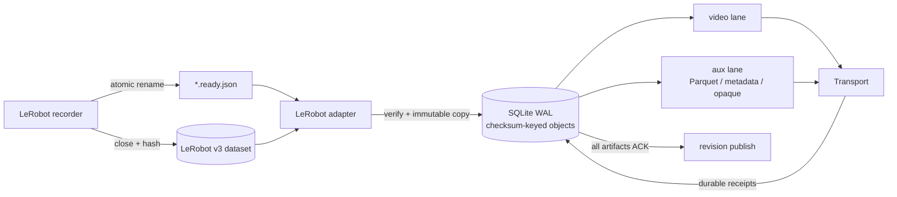

<div align="center">

# V-Modal Robotics / Physical AI SDK

### A crash-resilient uplink for Robotics/Physical AI streeaming data flow

**Immutable handoff · Checksum-keyed spool · Independent upload lanes · Restart reconciliation**

[](https://www.python.org/)
[](https://github.com/huggingface/lerobot)
[](https://github.com/v-modal/vmodal_sdk_robotics)
[](LICENSE)
[](pyproject.toml)

*The network will flap. Power will disappear. Recording must continue.*

</div>

`vmodal-robotics` moves finalized LeRobot dataset artifacts off a robot without
turning the recording process into a distributed system. The producer closes
its files and atomically publishes one `.ready.json` manifest. The SDK verifies
the handoff, copies the exact bytes into a durable local spool, and tracks every
artifact until it is durably acknowledged or explicitly blocked.

The base runtime is CPython plus
[Fire](https://github.com/google/python-fire). It does not import LeRobot,
PyTorch, pandas, ROS, GStreamer, or a database server. SQLite is provided by the
Python standard library.

## Robot-grade invariants

| Invariant | Mechanism |
|---|---|
| Producer data stays producer-owned | Admission copies files into the spool; rejection never deletes source data |
| Accepted bytes survive a process crash | Payload writes use a temporary file, `fsync`, atomic rename, and directory `fsync` |
| State transitions survive a restart | SQLite runs in WAL mode with `synchronous=FULL` |
| One artifact maps to one stable identity | IDs derive from dataset identity, relative path, and SHA-256 |
| Slow video cannot starve telemetry | Video and auxiliary artifacts run in independent async lanes |
| Video cannot consume the whole disk budget | A configurable byte reserve is held for telemetry and metadata |
| Dataset completion cannot race its payloads | A revision becomes publishable only after every artifact is acknowledged |
| A lost response is recoverable | Items left in `SENDING` are reconciled on startup when the transport supports it |
| Corrupt or moving inputs never enter the queue | Size, checksum, inode, mtime, path containment, and symlink checks gate admission |



## Boot it on a robot

Python 3.10 through 3.13 is supported. Install the tagged public source with
the V-Modal cloud transport:

```bash
python -m pip install \
  "vmodal-robotics[vmodal] @ git+https://github.com/v-modal/vmodal_sdk_robotics.git@v0.1.0"
```

For a custom transport, install the lean core:

```bash
python -m pip install \
  "vmodal-robotics @ git+https://github.com/v-modal/vmodal_sdk_robotics.git@v0.1.0"
```

Configure the standard `VMODAL_*` variables used by the V-Modal Python SDK,
then point the daemon at the producer handoff directory and a persistent local
disk:

```bash
export VMODAL_ROBOT_READY_DIR=/data/lerobot/vmodal-ready
export VMODAL_ROBOT_SPOOL_DIR=/var/lib/vmodal-robot

vmodal-robot run
```

Inspect the queue or drain it during a controlled shutdown:

```bash
vmodal-robot status --spool_dir=/var/lib/vmodal-robot
vmodal-robot flush --spool_dir=/var/lib/vmodal-robot --deadline_seconds=120
```

`run` catches `SIGINT` and `SIGTERM`, stops admission, and flushes the existing
backlog for up to `--shutdown_deadline` seconds.

## The handoff protocol

The ready manifest is a commit record. Publish it only after every referenced
file and the metadata snapshot are closed and immutable. Its filename must end
in `.ready.json`.

```json
{
  "contract_version": 1,
  "source_format": "lerobot",
  "source_version": "v3",
  "source_id": "arm-cell-07",
  "dataset_key": "gearbox/insertion",
  "dataset_root": "../dataset",
  "destination": "robot-data/arm-cell-07",
  "source_revision": "capture-000042",
  "complete": true,
  "artifacts": [
    {
      "path": "videos/chunk-000/observation.images.wrist.mp4",
      "kind": "video",
      "content_type": "video/mp4",
      "size_bytes": 73400320,
      "sha256": "0123456789abcdef0123456789abcdef0123456789abcdef0123456789abcdef",
      "source_refs": {
        "camera_key": "observation.images.wrist",
        "episodes": [40, 41],
        "video_offsets": [0.0, 8.42]
      },
      "timing": {
        "source_clock": "lerobot.timestamp",
        "start": 0.0,
        "end": 16.81
      }
    },
    {
      "path": "data/chunk-000/file-000.parquet",
      "kind": "telemetry",
      "content_type": "application/vnd.apache.parquet",
      "size_bytes": 8192,
      "sha256": "123456789abcdef0123456789abcdef0123456789abcdef0123456789abcdef0",
      "source_refs": {
        "episodes": [40, 41],
        "row_ranges": [[0, 252], [252, 504]]
      },
      "timing": {
        "source_clock": "lerobot.timestamp",
        "start": 0.0,
        "end": 16.81
      }
    },
    {
      "path": "meta/info.json",
      "kind": "metadata",
      "content_type": "application/json",
      "size_bytes": 2048,
      "sha256": "23456789abcdef0123456789abcdef0123456789abcdef0123456789abcdef01",
      "source_refs": {"snapshot": "capture-000042"}
    }
  ]
}
```

Replace the example sizes and hashes with values computed from the closed
files. Every revision requires at least one `metadata` artifact. Supported
artifact kinds are `video`, `telemetry`, `metadata`, and `opaque`; LeRobot
videos must be MP4 and telemetry files must be Parquet.

A robust producer handoff is deliberately boring:

1. Close the MP4, Parquet, and metadata snapshot.
2. Compute each byte length and SHA-256.
3. Write the manifest under a temporary filename in the ready directory.
4. Flush it, `fsync` it, and atomically rename it to `*.ready.json`.
5. Leave the referenced bytes immutable.

Absolute artifact paths, `..` escapes, symlinks, duplicate paths, missing
files, changing files, invalid checksums, and unsupported dataset versions are
rejected and recorded in the spool database.

## State machine and failure semantics

```text
                         transient failure
                    ┌────────────────────────┐
                    ▼                        │
READY ──claim──▶ SENDING ──ACK────────▶ ACKNOWLEDGED
                    │
                    ├──retry──────────▶ RETRY_WAIT
                    │                     │
                    │                     └──backoff elapsed──▶ SENDING
                    │
                    └──terminal / max attempts──────────────▶ BLOCKED

startup: SENDING ──reconcile──▶ ACKNOWLEDGED | READY | BLOCKED
```

Retries use exponential backoff with jitter: one second initially, capped at
five minutes, with ten attempts by default. A transport receipt is accepted
only when it carries the expected item identity, `ACKNOWLEDGED` state, a stable
remote reference, and a non-conflicting checksum.

| Event | Result |
|---|---|
| Robot loses power while a source is being copied | The incomplete temporary object is removed on the next start |
| Source changes during admission | The entire handoff is rejected and its source remains untouched |
| Spool byte or record quota is reached | New handoffs are rejected; the durable backlog remains intact |
| Upload succeeds but the response is lost | Startup reconciliation asks the transport for the remote outcome |
| Network request times out | The item enters `RETRY_WAIT` with bounded exponential backoff |
| Artifact receipt conflicts with the local checksum | The artifact enters `BLOCKED` immediately |
| Process receives `SIGTERM` | Admission stops and the accepted backlog drains until the shutdown deadline |

## Scheduling and storage bounds

The video lane and auxiliary lane each claim one item per cycle and execute
concurrently. Dataset revisions are serialized behind their artifacts. Default
limits are intentionally finite:

| Control | Default | CLI / environment |
|---|---:|---|
| Total spool bytes | 10 GiB | `--max_bytes` / `VMODAL_ROBOT_MAX_BYTES` |
| Reserved auxiliary bytes | 512 MiB | `--aux_reserve_bytes` / `VMODAL_ROBOT_AUX_RESERVE_BYTES` |
| Spool records | 10,000 | `--max_records` / `VMODAL_ROBOT_MAX_RECORDS` |
| Single video bytes | 100 MiB | `SpoolConfig.max_video_bytes` |
| Discovery poll | 1 s | `--poll_seconds` |
| Request timeout | 120 s | `--request_timeout_seconds` |
| Shutdown drain | 30 s | `--shutdown_deadline` |

Use a spool path on persistent storage. `status` emits machine-readable JSON
with queue depth and bytes per lane, oldest item age, disk headroom, retry and
rejection counts, blocked items, and the latest durable receipt:

```bash
vmodal-robot status --spool_dir=/var/lib/vmodal-robot | python -m json.tool
```

## Transport boundary

The runner depends on three async transport operations:

```python
class Transport:
    async def deliver(self, artifact, destination): ...
    async def reconcile(self, artifact, destination): ...
    async def publish_revision(self, revision): ...
```

This narrow seam makes S3, R2, an on-prem object store, or a lab receiver easy
to integrate without importing those clients into the recorder. A successful
operation returns a `Receipt` with a stable `remote_ref` and status
`ACKNOWLEDGED`.

Current V-Modal cloud support is explicit:

| Operation | Built-in `VmodalTransport` |
|---|---|
| MP4 delivery | Qualified through `collections.video_upload` |
| Telemetry, metadata, and opaque delivery | Requires a generic `artifact_api` implementation |
| Remote reconciliation | Requires a generic `artifact_api` implementation |
| Dataset revision publication | Requires a generic `artifact_api` implementation |

Until the generic artifact and revision endpoints are qualified, the built-in
transport places those operations in `BLOCKED`. It never routes original
Parquet or metadata bytes through a video-description endpoint.

## Hack on it

Clone the public repository and run the complete fake-data suite:

```bash
git clone https://github.com/v-modal/vmodal_sdk_robotics.git
cd vmodal_sdk_robotics
bash test.sh test
```

The suite uses tiny synthetic MP4, Parquet, metadata, and opaque payloads. It
exercises byte-for-byte delivery, multi-camera and multi-episode references,
lane independence, quota rejection, retry backoff, lost responses, process
restart reconciliation, cleanup, the custom adapter seam, packaging, and a
clean public install. No robot, camera, ROS graph, or cloud account is needed.

```text
src/vmodal_robot/
├── adapters/lerobot.py      # strict LeRobot v3 ready-manifest parser
├── contracts.py             # adapter, artifact, revision, receipt, transport
├── runner.py                # scheduler, retries, recovery, graceful drain
├── spool.py                 # durable state machine + content-addressed objects
├── transports/vmodal.py     # optional V-Modal cloud bridge
└── utils.py                 # hashing, safe paths, atomic durable copies
```

Useful entry points:

```bash
vmodal-robot --help
vmodal-robot run --help
vmodal-robot status --help
vmodal-robot flush --help
bash test.sh package
```

If you are integrating a new recorder or transport, keep the invariant that
matters most: **the recorder owns mutable files; the uploader owns immutable
bytes.**
