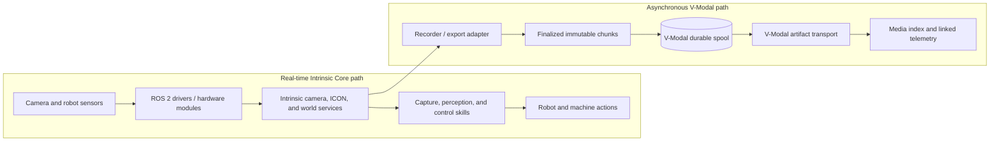
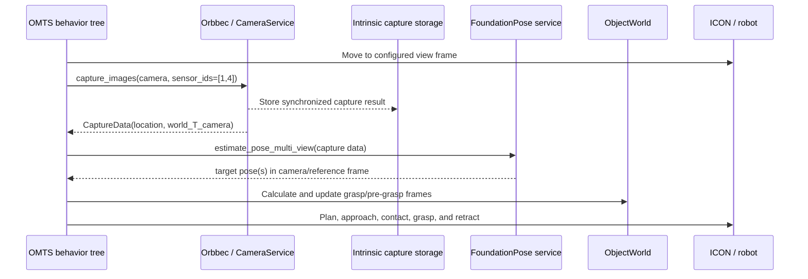
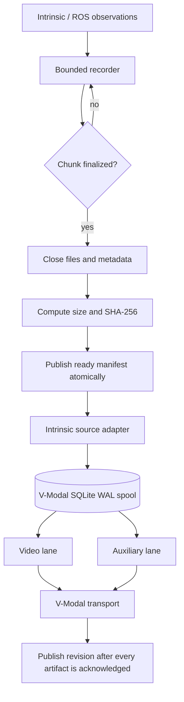

# Intrinsic Core for robotics and V-Modal integration

> **Status:** Architecture and integration guide. The Intrinsic-to-V-Modal
> connector described here is proposed; it is not implemented by the two
> upstream Intrinsic repositories or by this directory.
>
> **Reviewed:** 23 September 2026.

## 1. summary

Intrinsic Core is an open, local robotics runtime and SDK for building and
running industrial robot applications. It combines a containerized runtime,
real-time robot control, motion planning, perception, local model inference,
an object-world/digital-twin model, reusable skills, and ROS 2
interoperability. It is reasonable to describe it as a robotics operating
layer, but its official open-source name is **Intrinsic Core**.

The [Open Machine Tending Solution (OMTS)](https://github.com/intrinsic-ai/intrinsic-omts)
is the clearest reference application. It connects an Orbbec RGB-D camera,
robot arm, gripper, force/torque feedback, and machine digital I/O to a single
behavior tree. Camera captures feed FoundationPose-based 6-DoF pose
estimation; the result updates grasp frames in the Intrinsic ObjectWorld; the
motion and contact skills then use those frames and live sensor feedback to
perform the work.

V-Modal should complement that real-time path, not sit inside it. The proposed
integration copies finalized camera recordings and synchronized sensor data to
a durable local V-Modal spool, uploads them asynchronously, and creates a
searchable observation history. Intrinsic Core remains the authority for
control, safety, calibration, transforms, and live world state. V-Modal is the
durable media/data and retrieval layer.

The target split is:



No cloud upload, encoder, or search request should block the Intrinsic control
loop or determine whether a safety-critical action proceeds.

## 2. What Intrinsic Core provides

The [Intrinsic Core repository](https://github.com/intrinsic-ai/intrinsic-core)
describes the platform as a local, hardware-agnostic, real-time control
framework for industrial robotics. Its principal modules are:

| Module | Role in a robot application | Data relevant to V-Modal |
| --- | --- | --- |
| `intrinsic_runtime` | Local k3s-based execution environment, service lifecycle, scheduling, and state synchronization | Deployment, skill, and execution context |
| `intrinsic_control` / ICON | Deterministic control, controller switching, robot HAL, and live sensor-driven control | Joint state, wrench/force-torque state, digital I/O, action status |
| `intrinsic_motion_planning` | Collision-aware Cartesian and joint-space planning | Plans, constraints, target frames, execution outcome |
| `intrinsic_perception` | Camera and point-cloud interfaces, capture services, calibration, and 6-DoF perception | RGB, depth, point clouds, calibration, capture timestamps, pose estimates |
| `intrinsic_inference` | Local accelerated model serving | Detections, pose estimates, model/version context |
| `intrinsic_sdk` | APIs and types for skills, assets, hardware, and execution nodes | Stable application-side integration boundary |
| `intrinsic_apis` | Protobuf service and message definitions | Exact wire contracts for captures and robot state |
| `intrinsic_hardware` | Device drivers, manifests, and service integrations | Physical device identity and capabilities |
| `intrinsic_kinematics` | Robot kinematic models and solvers | Frame transforms and robot configuration |

Applications connect to a running deployment and submit skills or a composed
behavior tree through the Solution Building Library (SBL). Services exchange
typed data, commonly over gRPC, while ROS 2 interoperability provides access
to existing drivers and ROS-native equipment. The reference README currently
lists Ubuntu and ROS 2 prerequisites; use the release documentation matching
the deployed Intrinsic Core tag rather than assuming the `main` branch's
versions apply to an older cell.

### Intrinsic Core versus ROS 2

Intrinsic Core is not a replacement for every ROS driver. It places an
integrated runtime, skill model, world model, real-time controller, and
hardware abstraction above and alongside ROS 2. In an OMTS deployment, ROS
camera and gripper services can coexist with native Intrinsic services and
skills. This is useful for V-Modal because a recorder can be attached at one
of several boundaries:

1. ROS 2 topics, when continuous source messages are required.
2. Intrinsic `CameraService` captures, when task-triggered RGB-D observations
   are sufficient.
3. SBL skill inputs/results and execution logs, when semantic task context is
   more important than every raw sample.
4. Finalized application-generated episode files, when training/search data
   must be portable and replayable.

These boundaries are alternatives, not interchangeable representations. A
pose-estimation result cannot reconstruct the original depth image, and an
MP4 preview cannot reconstruct a calibrated depth map or point cloud.

## 3. OMTS as the reference architecture

[OMTS](https://github.com/intrinsic-ai/intrinsic-omts) is an open-source CNC
machine-tending application built on Intrinsic Core. Its solution package
declares robot and gripper hardware, an Orbbec Gemini 335Le camera, the
Flowstate ROS bridge, camera and gripper driver services, FoundationPose and
segmentation models, machine I/O, simulation, and ObjectWorld assets. Its
application binary connects to that deployment, builds one behavior tree, and
runs the tree through the executive service.

The relevant separation is:

| Layer | OMTS example | Responsibility |
| --- | --- | --- |
| Physical input | Orbbec camera, UR arm sensors, force/torque state, Robotiq gripper, CNC DIO | Produce measurements and accept commands |
| Driver/bridge | Orbbec ROS driver, Flowstate ROS bridge, robot hardware module | Convert vendor/ROS interfaces into platform resources |
| Core service | Camera service, ICON, ObjectWorld, pose estimator, inference service | Capture, control, transforms, perception, and state |
| Adapter | `OrbbecVision`, robot/gripper/machine adapters | Build typed SBL tasks without leaking driver details into behavior code |
| Orchestration | One SBL behavior tree | Order capture, estimation, motion, I/O, retries, and recovery |
| Proposed data sink | Intrinsic recorder plus V-Modal spool | Preserve and upload finalized observation artifacts |

OMTS deliberately keeps hardware adapters stateless. This makes the same
design appropriate for V-Modal: recording/export should be a separate data
adapter, not an added responsibility of `OrbbecVision` or the control skills.

## 4. Camera input flow

### 4.1 From the device to Intrinsic Core

The OMTS camera resource is configured with a ROS camera identifier containing
the driver type and device ID. The solution also deploys the Orbbec driver and
Flowstate ROS bridge bundles. At the Intrinsic API boundary,
`CameraService.DescribeCamera` enumerates sensors and `CameraService.Capture`
requests frames from selected sensor IDs.

The underlying Intrinsic ROS image source supports ROS image and point-cloud
snapshot messages as well as camera information. The normalized capture
contract is more useful than assuming one vendor topic layout:

```text
physical RGB-D camera
  -> vendor ROS 2 camera driver
  -> ROS image / depth / point-cloud and camera-info interfaces
  -> Intrinsic ROS camera adapter
  -> Intrinsic CameraService
  -> CaptureResult
       capture_at
       capture_duration (optional)
       sensor_images[]
         sensor_config (calibration and sensor description)
         acquisition_time
         image buffer
```

`CaptureRequest.sensor_ids` is a transmit mask. An empty list requests all
sensor images; a specified list returns only those sensors. The same request
can specify per-sensor post-processing and a key-value storage location. When
storage is requested, the response can contain a storage reference rather
than embedding the full capture result.

This distinction matters for V-Modal. A connector must resolve and preserve
the referenced capture bytes before their retention expires; it must not
mistake a storage locator for the image payload itself.

### 4.2 The OMTS RGB-D perception flow

OMTS configures `sensor_ids: [1, 4]` for the Orbbec resource. The IDs are
deployment configuration, not a universal promise that sensor 1 is always RGB
and sensor 4 is always depth. The adapter should call `DescribeCamera` and
persist each returned sensor description rather than hard-code that meaning.

For a vision-guided pick, the behavior tree executes:



The open OMTS `OrbbecVision` implementation creates a `capture_images` task,
passes its `capture_data` result to `estimate_pose_multi_view`, and then runs a
Python calculation that updates grasp and pre-grasp frames. The Intrinsic
`CaptureData` protobuf carries the capture-result storage location and
`world_T_camera`; it may also carry a reference-frame-to-camera transform.
Those transforms are essential provenance for later interpretation.

The camera stream therefore has two data products:

- **Raw observation:** RGB/depth/point-cloud buffers, sensor configuration,
  timestamps, and camera transforms.
- **Derived semantics:** detected object identity, 6-DoF estimate,
  confidence/visibility settings, chosen grasp frames, and skill outcome.

V-Modal should preserve the relationship between them. Indexing only the RGB
video loses geometry; preserving only the depth capture makes visual search
and human review difficult.

### 4.3 Continuous video versus triggered capture

OMTS is task-triggered: the behavior tree captures observations when it needs
to estimate a pose. V-Modal use cases may additionally require continuous
video for audit, search, or dataset creation. That requires an explicit
recorder on the ROS/camera side; repeatedly calling a task capture API is not
automatically equivalent to a fixed-frame-rate video recorder.

Recommended modes are:

| Mode | Capture source | Best use | Important limitation |
| --- | --- | --- | --- |
| Task observation | `capture_images` result and skill context | Explain a pick, inspect perception, build sparse episodic records | Does not represent everything between task captures |
| Continuous camera record | ROS image/depth topics or driver-supported recording | Searchable workcell history and dense datasets | Must control bandwidth, synchronization, and disk use |
| Hybrid | Continuous low/medium-rate RGB plus lossless task-triggered RGB-D snapshots | Practical default | Requires reliable timestamp and capture-ID linking |

The hybrid mode avoids uploading raw depth at video rate when that is not
needed, while retaining full-fidelity geometry at the moments used for robot
decisions.

## 5. Other sensor and state inputs

Camera media alone does not describe a robot episode. Intrinsic Core exposes
or models several other signal classes that should be recorded as structured
telemetry when the deployment permits it.

| Signal | Example content | Why retain it | Suggested artifact |
| --- | --- | --- | --- |
| Robot joint state | Position, velocity, acceleration, torque | Replay motion, align video with configuration, diagnose limits | Parquet or schema-defined MCAP |
| Force/torque | Sensor-frame wrench, tip-frame wrench, stability state | Explain contact, insertion, protective stops, and grasp quality | Parquet/MCAP with frame and units |
| Tool/gripper state | Command, finger position, open/closed result | Link manipulation state to visible events | Parquet/JSONL |
| Digital I/O | CNC door, vise, cycle-start, cycle-complete signals | Segment the manufacturing cycle and find machine events | Parquet/MCAP |
| ObjectWorld updates | Object/frame transforms, attachments, door/vise joints | Reconstruct the robot's believed scene | Protobuf/JSON snapshot plus deltas |
| Skill/executive events | Skill name, start/end, status, error code, retry | Create semantic episode boundaries and searchable labels | JSONL or Parquet |
| Perception output | Object ID, pose, confidence, estimator/model version | Compare model decisions with source imagery | Protobuf/JSON/Parquet |
| Configuration | Cell, camera, calibration, model, and application config versions | Make data reproducible | Immutable metadata snapshot |

Do not read safety-critical signals by inserting work into the real-time
control thread. Use a supported status/logging/pub-sub interface, sample at a
bounded rate, and move serialization and upload to a non-real-time process.

### DIO and belief-world state are different

OMTS commands physical CNC/vise outputs and then updates the corresponding
ObjectWorld joints so collision checking reflects the expected physical
state. Record both the physical I/O observation and the world update. A world
state is a belief; it is not proof that a door or vise physically reached its
position unless the hardware supplies confirming input.

### Force/torque needs frame metadata

Intrinsic APIs distinguish uncompensated sensor-frame wrench, compensated
sensor-frame wrench, and wrench transformed to the robot tip. Store the exact
field, coordinate frame, unit, sampling time, and compensation state. A vector
of six numbers without that metadata is unsafe to compare or reuse.

## 6. Proposed V-Modal integration

### 6.1 Integration principle

The connector should export **immutable, time-bounded artifacts** from
Intrinsic/ROS into the existing V-Modal robotics spool. It should not upload
each raw frame as an independent cloud request and should not make network
availability part of robot execution.



The local robotics SDK already supplies the durable portion of this design:

- immutable admission with size/checksum/path validation;
- stable artifact and dataset identities;
- SQLite WAL state and crash recovery;
- separate video and auxiliary upload lanes;
- bounded retries and restart reconciliation;
- revision publication only after all artifacts are acknowledged.

Its current `LeRobotAdapter` accepts only explicit LeRobot v3 ready manifests.
Intrinsic data must therefore use one of these paths:

1. **Preferred: add an `IntrinsicAdapter`.** It reads an Intrinsic-specific
   ready manifest and maps artifacts to the existing `ArtifactInput` and
   `RevisionInput` contracts. This preserves native capture protobufs, MCAP,
   calibration, and world metadata without pretending they are LeRobot.
2. **Dataset path: produce a genuine LeRobot v3 dataset.** Use this only when
   the source has been deliberately converted into LeRobot observations,
   actions, videos, telemetry, and metadata. Do not change a format label to
   bypass validation.
3. **Video-only MVP: emit finalized MP4 chunks.** This can use the presently
   qualified `collections.video_upload` path, but it is not a complete robot
   dataset and must not be presented as one.

### 6.2 What is supported by the current V-Modal transport

The existing local `VmodalTransport` has an important qualification:

| Operation | Current state |
| --- | --- |
| MP4 upload | Implemented through `collections.video_upload` with `reduce_size=False` |
| Telemetry, metadata, depth, point clouds, MCAP, protobuf | Blocked unless a qualified generic `artifact_api` is injected |
| Remote reconciliation | Requires the generic `artifact_api` |
| Dataset revision publication | Requires the generic `artifact_api` |

Therefore, a production Intrinsic integration requires the generic artifact
and revision API to be implemented and qualified. Until then, only the video
portion can use the standard V-Modal cloud route. The spool can retain other
artifacts locally, but local retention is not a cloud acknowledgement.

### 6.3 Recommended artifact set

One V-Modal revision should represent one bounded robot session, episode,
behavior-tree cycle, or explicitly defined time window. A practical hybrid
revision contains:

```text
revisions/<revision-id>/
  video/
    wrist_rgb_000042.mp4
  captures/
    pick_000042.capture_result.pb
    pick_000042.depth.png        # only if a lossless exported representation is defined
  telemetry/
    robot_state_000042.parquet
    io_and_skill_events_000042.parquet
  world/
    object_world_start.pb
    object_world_events.pb
  meta/
    revision.json
    camera_description.pb
    calibration_snapshot.pb
    application_config.yaml
    checksums.json
```

Preserve original protobuf/MCAP bytes where possible. Derived MP4, PNG,
Parquet, thumbnails, embeddings, or text labels should point back to the
source artifact and declare the converter name/version. A derived file must
not silently replace the original.

### 6.4 manifest contract

The exact schema should be versioned in code. The following illustrates the
information an Intrinsic adapter needs; it is not an implemented CLI contract:

```json
{
  "contract_version": 1,
  "source_format": "intrinsic_core",
  "source_version": "<intrinsic-release-tag>",
  "source_id": "machine-cell-01",
  "dataset_key": "cnc/machine-tending",
  "destination": "robot-data/machine-cell-01",
  "source_revision": "cycle-000042",
  "complete": true,
  "context": {
    "behavior_tree": "omts",
    "cycle": 42,
    "operation_mode": "real",
    "camera_resource": "orbbec_camera",
    "capture_id": "pick-000042"
  },
  "artifacts": [
    {
      "path": "video/wrist_rgb_000042.mp4",
      "kind": "video",
      "content_type": "video/mp4",
      "size_bytes": 73400320,
      "sha256": "<64-lowercase-hex-characters>",
      "timing": {
        "source_clock": "ros_time",
        "start": 1758566400.000,
        "end": 1758566410.000
      },
      "source_refs": {
        "camera_resource": "orbbec_camera",
        "sensor_id": 1,
        "frame_id": "camera_color_optical_frame"
      }
    },
    {
      "path": "telemetry/robot_state_000042.parquet",
      "kind": "telemetry",
      "content_type": "application/vnd.apache.parquet",
      "size_bytes": 8192,
      "sha256": "<64-lowercase-hex-characters>",
      "timing": {
        "source_clock": "ros_time",
        "start": 1758566400.000,
        "end": 1758566410.000
      },
      "source_refs": {
        "schema": "intrinsic.robot_state.v1",
        "time_unit": "seconds",
        "joint_position_unit": "radian"
      }
    },
    {
      "path": "meta/revision.json",
      "kind": "metadata",
      "content_type": "application/json",
      "size_bytes": 2048,
      "sha256": "<64-lowercase-hex-characters>",
      "source_refs": {
        "snapshot": "cycle-000042"
      }
    }
  ]
}
```

The producer must close every referenced file, compute the real byte length
and SHA-256, write the manifest under a temporary name, flush it, and rename it
atomically to `*.ready.json`. The adapter then copies the immutable bytes into
the spool. It must never ingest active camera files based only on a quiet file
size interval.

## 7. Identity, timing, and synchronization

Robotics data becomes unreliable when identity and clocks are treated as
incidental metadata.

### Required identities

At minimum record:

- workcell/robot and deployment identity;
- Intrinsic Core and OMTS commit or release tag;
- behavior-tree execution and cycle ID;
- camera resource, physical device ID, sensor ID, and ROS frame ID;
- capture ID and original Intrinsic storage locator where safe;
- model/estimator ID and version;
- artifact checksum and immutable revision ID.

Do not persist expiring signed download URLs as identities. Persist the stable
capture, object, revision, and remote receipt identifiers.

### Clock rules

Keep these timestamps distinct:

- sensor acquisition time;
- synchronized capture time;
- ROS or simulation time;
- robot/controller sample time;
- skill start/end time;
- recorder wall-clock time;
- V-Modal admission and upload time.

Store the source clock name, time unit, and any measured mapping to another
clock. Equal numeric timestamps do not prove a shared clock domain. For
multi-sensor RGB-D data, preserve each `SensorImage.acquisition_time` even
though `CaptureResult.capture_at` provides a convenient common capture time.

### Transform rules

Preserve the transform direction in the field name, for example
`world_T_camera` or `camera_T_target`. Also store frame IDs and the calibration
snapshot used for that observation. Do not reduce transforms to unlabelled
arrays. When OMTS derives `world_T_target` from camera extrinsics and a pose
estimate, retain both inputs and the derived result.

## 8. Search and retrieval model

After ingestion, V-Modal can make the visual stream searchable while linked
telemetry supplies filters and context. Example queries include:

- "show every failed grasp after a low-confidence pose estimate";
- "find cycles where the CNC door was open while the robot approached";
- "show contact events with unusually high Z force";
- "find visually similar raw parts and compare the selected grasp pose";
- "retrieve the RGB-D capture and joint state used for cycle 42."

This requires an index document that joins a video time range to source
artifact offsets and semantic events. A useful logical record is:

```text
workcell + revision + capture/event ID
  -> video artifact and time range
  -> RGB-D/point-cloud source artifact
  -> robot-state row/time range
  -> world/calibration snapshot
  -> behavior-tree node, skill result, and error/status
```

V-Modal search results should return stable source references, not only a
thumbnail and approximate wall time. The client can then retrieve the original
capture or telemetry interval for engineering analysis.

## 9. Runtime behavior and failure handling

| Failure | Required behavior |
| --- | --- |
| V-Modal/cloud unavailable | Continue robot operation and local recording within configured storage limits; retry asynchronously |
| Recorder disk nearing limit | Warn, stop opening new chunks before reserve is exhausted, finalize active chunks, and report data gaps; never delete unacknowledged data silently |
| Process or robot power loss | Recover the spool; remove incomplete temporary copies; rediscover finalized producer files; do not mark active partial files complete |
| Upload stored remotely but response lost | Reconcile using stable artifact identity before retrying or deleting local bytes |
| Camera disconnect | Report the source gap, allow unrelated sensors/control to continue according to the robot application, and start a new chunk after recovery |
| Clock reset or simulation reset | Start a new time segment/boot ID; never force timestamps to remain monotonic by rewriting source time |
| Partial revision | Retain it as incomplete; publish completion only after every required artifact is durably acknowledged |
| Unknown sensor ID or schema | Preserve opaque bytes and metadata if safe, mark semantic decoding unsupported, and do not invent a mapping |

Upload bandwidth, CPU use, and disk I/O must be bounded. Prefer hardware video
encoding or a separate recorder process. On a constrained controller, move the
recorder/uploader to an edge computer connected to the same workcell network.

## 10. Security and safety boundaries

- Keep cloud credentials out of Intrinsic/OMTS configuration and ready
  manifests. Use the existing V-Modal SDK credential mechanism or a secret
  provider.
- Treat camera images and factory telemetry as potentially sensitive. Define
  retention, access, encryption, and redaction policies before upload.
- Use least-privilege, outbound-only network access from the uploader where
  possible.
- Do not expose Intrinsic control gRPC, ROS control topics, or hardware I/O to
  a search client.
- Search results are observations, not control commands. Any later
  search-to-action workflow needs explicit validation and safety gating inside
  the robot application.
- Never let V-Modal backpressure, authentication failure, or response latency
  enter ICON's real-time execution path.

## 11. Suggested implementation plan

1. **Choose the observation boundary.** Start with hybrid RGB video plus
   task-triggered RGB-D captures and bounded robot/skill telemetry.
2. **Define schemas and clocks.** Version the camera, robot-state, DIO,
   world-event, and skill-event records. Document units and frame conventions.
3. **Build the recorder/exporter.** Write time-bounded files, immutable
   metadata snapshots, checksums, and atomic ready manifests.
4. **Add a native `IntrinsicAdapter`.** Reuse the current V-Modal artifact,
   revision, spool, runner, and receipt contracts. Do not duplicate spool or
   retry logic.
5. **Qualify the generic artifact API.** Verify upload, idempotency,
   reconciliation, checksum conflict handling, and revision publication for
   MP4, protobuf/MCAP, Parquet, and metadata.
6. **Add derived indexing.** Generate thumbnails/embeddings and event links
   without discarding native artifacts.
7. **Exercise failures.** Test process kill, robot reboot, network loss,
   response loss after remote commit, disk pressure, camera disconnect,
   duplicate discovery, partial capture, and clock reset.
8. **Validate one full OMTS cycle.** Confirm counts, checksums, timestamps,
   RGB-depth pairing, transforms, joint/force alignment, skill events, and
   retrieval from a V-Modal search result back to source bytes.

### Minimum acceptance checks

- The Intrinsic behavior tree completes with the uploader stopped and with the
  network disconnected.
- A recorded capture can be traced from camera resource and sensor ID through
  its video/depth artifacts, calibration, pose estimate, world update, and
  robot action.
- Restarting the connector produces no duplicate logical revision and loses no
  acknowledged state.
- Source and staged checksums match; every remote receipt has a stable identity.
- An MP4 search hit resolves to the correct source-clock interval and linked
  telemetry rows.
- Pending data is never deleted merely to free space; any configured retention
  deletion requires a verified acknowledgement and an explicit policy.

## 12. Known limits and non-claims

- Neither reviewed Intrinsic repository contains a V-Modal connector.
- This repository's existing robotics adapter is LeRobot-v3-specific; a native
  Intrinsic adapter remains implementation work.
- Standard V-Modal transport currently qualifies MP4 delivery, not generic
  telemetry/metadata/depth/revision delivery.
- OMTS demonstrates an Orbbec RGB-D and machine-tending setup; it does not
  prove that every Intrinsic camera, sensor, or robot exports identical IDs,
  topics, rates, or timestamps.
- `log_debug_data=True` is useful for Intrinsic diagnostics but is not a
  defined long-term dataset export or V-Modal retention policy.
- A ROS bridge provides interoperability, not automatic durable recording.
- An MP4 is a searchable visual derivative, not a substitute for depth, point
  clouds, calibration, robot state, actions, or safety logs.
- The open repositories carry their own support/product disclaimers. Check
  licenses, release notes, and platform terms for the deployed versions.

## 13. Primary sources

### Intrinsic Core

- [Intrinsic Core repository and module overview](https://github.com/intrinsic-ai/intrinsic-core)
- [Camera service protobuf](https://github.com/intrinsic-ai/intrinsic-core/blob/main/intrinsic_apis/intrinsic/perception/proto/v1/camera_service.proto)
- [Capture result protobuf](https://github.com/intrinsic-ai/intrinsic-core/blob/main/intrinsic_apis/intrinsic/perception/proto/v1/capture_result.proto)
- [Capture data protobuf](https://github.com/intrinsic-ai/intrinsic-core/blob/main/intrinsic_apis/intrinsic/perception/proto/v1/capture_data.proto)
- [Sensor image protobuf](https://github.com/intrinsic-ai/intrinsic-core/blob/main/intrinsic_apis/intrinsic/perception/proto/v1/sensor_image.proto)
- [Part status protobuf for joint, wrench, and DIO state](https://github.com/intrinsic-ai/intrinsic-core/blob/main/intrinsic_apis/intrinsic/icon/proto/part_status.proto)
- [Intrinsic-compatible ROS camera drivers](https://github.com/intrinsic-ai/intrinsic-ros-camera-drivers)

### Open Machine Tending Solution

- [OMTS repository and execution pipeline](https://github.com/intrinsic-ai/intrinsic-omts)
- [OMTS system architecture](https://github.com/intrinsic-ai/intrinsic-omts/blob/main/docs/ARCHITECTURE.md)
- [OMTS vision hardware adapter](https://github.com/intrinsic-ai/intrinsic-omts/blob/main/src/hardware/vision.py)
- [OMTS hardware abstraction layer](https://github.com/intrinsic-ai/intrinsic-omts/blob/main/src/hardware/README.md)
- [OMTS solution composition](https://github.com/intrinsic-ai/intrinsic-omts/blob/main/BUILD)
- [OMTS application configuration](https://github.com/intrinsic-ai/intrinsic-omts/blob/main/configs/omts/app_config.yaml)

### Local V-Modal implementation used for this proposal

- [`../lerobot/README.md`](../lerobot/README.md) — durable spool, ready
  manifest, state machine, and transport limitations.
- [`../lerobot/src/vmodal_robot/contracts.py`](../lerobot/src/vmodal_robot/contracts.py)
  — artifact, revision, receipt, adapter, and transport contracts.
- [`../lerobot/src/vmodal_robot/spool.py`](../lerobot/src/vmodal_robot/spool.py)
  — durable admission, identity, state, and quota handling.
- [`../lerobot/src/vmodal_robot/runner.py`](../lerobot/src/vmodal_robot/runner.py)
  — upload lanes, retry, reconciliation, and revision scheduling.
- [`../lerobot/src/vmodal_robot/transports/vmodal.py`](../lerobot/src/vmodal_robot/transports/vmodal.py)
  — current V-Modal cloud transport boundary and qualification limits.
