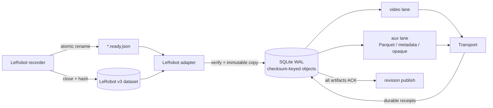

<div align="center">

# V-Modal Robotics SDK

### A crash-resilient uplink for robotics streaming data.

**Immutable handoff · Durable spool · Independent upload lanes · Qualified transport required**

[](https://www.python.org/)
[](https://github.com/huggingface/lerobot)
[](https://github.com/v-modal/vmodal_sdk_robotics)
[](LICENSE)
[](pyproject.toml)
[](https://v-modal.github.io/vmodal_sdk_robotics/)

*The network will flap. Power will disappear. Recording must continue.*

</div>

`vmodal-robotics` moves finalized LeRobot dataset artifacts off a robot without
turning the recording process into a distributed system. The producer closes
its files and atomically publishes one `.ready.json` manifest. The SDK verifies
the handoff, copies the exact bytes into a durable local spool, and tracks every
artifact until it is durably acknowledged or explicitly blocked.

The base runtime is CPython plus
[Fire](https://github.com/google/python-fire). It does not import LeRobot,
PyTorch, pandas, ROS, GStreamer, or a database server. SQLite is provided by the
Python standard library.

Browse the generated [Robotics SDK API reference](https://v-modal.github.io/vmodal_sdk_robotics/),
the [transport and recovery contract](docs/transport_contract.md), and the
[search qualification guide](docs/search_qualification.md).

The stock cloud constructor is deliberately unavailable: no generic artifact
storage and revision backend has been qualified and wired into `from_env()`.
`run` and `flush` fail capability validation before creating a spool or accepting
producer data. A qualified custom transport can use the Python runner seam.
Local fault tests establish daemon behavior; they do not qualify cloud delivery,
robot-domain recall, large native shards, or capture-to-decision latency.

## Robot-grade invariants

| Invariant | Mechanism |
|---|---|
| Producer data stays producer-owned | Admission copies files into the spool; rejection never deletes source data |
| Accepted bytes survive a process crash | Payload writes use a temporary file, `fsync`, atomic rename, and directory `fsync` |
| State transitions survive a restart | SQLite runs in WAL mode with `synchronous=FULL` |
| One artifact maps to one stable identity | IDs derive from dataset identity, relative path, and SHA-256 |
| Slow video cannot starve telemetry | Video and auxiliary artifacts run in independent async lanes |
| Video cannot consume the whole disk budget | A configurable byte reserve is held for telemetry and metadata |
| Dataset completion cannot race its payloads | A revision becomes publishable only after every artifact is acknowledged |
| A lost response retains its bytes | Unknown outcomes stay `SENDING` unless reconciliation or qualified idempotent replay resolves them |
| Corrupt or moving inputs never enter the queue | Size, checksum, inode, mtime, path containment, and symlink checks gate admission |



## Boot it on a robot

Python 3.10 through 3.13 is supported. The public repository contains the package
under `lerobot/`. Install its optional reference Python SDK dependency with:

```bash
python -m pip install \
  "vmodal-robotics[vmodal] @ git+https://github.com/v-modal/vmodal_sdk_robotics.git@v0.1.0#subdirectory=lerobot"
```

For a custom transport, install the lean core:

```bash
python -m pip install \
  "vmodal-robotics @ git+https://github.com/v-modal/vmodal_sdk_robotics.git@v0.1.0#subdirectory=lerobot"
```

The following CLI wiring is reserved for a future qualified stock backend;
currently `run` and `flush` report missing transport capabilities. Setting
credentials does not enable generic artifact publication. For a qualified custom
backend, construct `Runner` in Python as described in the transport guide.
The CLI uses these persistent paths:

```bash
export VMODAL_ROBOT_READY_DIR=/data/lerobot/vmodal-ready
export VMODAL_ROBOT_SPOOL_DIR=/var/lib/vmodal-robot

vmodal-robot run
```

Inspect the queue or drain it during a controlled shutdown:

```bash
vmodal-robot status --spool_dir=/var/lib/vmodal-robot
vmodal-robot flush --spool_dir=/var/lib/vmodal-robot --deadline_seconds=120
```

With a qualified transport, `run` catches `SIGINT` and `SIGTERM`, stops admission,
and uses one deadline from signal receipt for recovery, in-flight uploads,
publication, and client close. `flush` starts that budget at invocation. A second
signal forces cancellation. Cooperative filesystem copying stops between chunks;
a kernel I/O call that never returns requires a process supervisor hard stop.
An incomplete or blocked drain exits unsuccessfully while preserving payloads.

## The handoff protocol

The ready manifest is a commit record. Publish it only after every referenced
file and the metadata snapshot are closed and immutable. Its filename must end
in `.ready.json`.

```json
{
  "contract_version": 1,
  "source_format": "lerobot",
  "source_version": "v3",
  "source_id": "arm-cell-07",
  "dataset_key": "gearbox/insertion",
  "dataset_root": "../dataset",
  "destination": "robot-data/arm-cell-07",
  "source_revision": "capture-000042",
  "complete": true,
  "artifacts": [
    {
      "path": "videos/chunk-000/observation.images.wrist.mp4",
      "kind": "video",
      "content_type": "video/mp4",
      "size_bytes": 73400320,
      "sha256": "0123456789abcdef0123456789abcdef0123456789abcdef0123456789abcdef",
      "source_refs": {
        "camera_key": "observation.images.wrist",
        "episodes": [40, 41],
        "video_offsets": [0.0, 8.42]
      },
      "timing": {
        "source_clock": "lerobot.timestamp",
        "start": 0.0,
        "end": 16.81
      }
    },
    {
      "path": "data/chunk-000/file-000.parquet",
      "kind": "telemetry",
      "content_type": "application/vnd.apache.parquet",
      "size_bytes": 8192,
      "sha256": "123456789abcdef0123456789abcdef0123456789abcdef0123456789abcdef0",
      "source_refs": {
        "episodes": [40, 41],
        "row_ranges": [[0, 252], [252, 504]]
      },
      "timing": {
        "source_clock": "lerobot.timestamp",
        "start": 0.0,
        "end": 16.81
      }
    },
    {
      "path": "meta/info.json",
      "kind": "metadata",
      "content_type": "application/json",
      "size_bytes": 2048,
      "sha256": "23456789abcdef0123456789abcdef0123456789abcdef0123456789abcdef01",
      "source_refs": {"snapshot": "capture-000042"}
    }
  ]
}
```

Replace the example sizes and hashes with values computed from the closed
files. Every revision requires at least one `metadata` artifact. Supported
artifact kinds are `video`, `telemetry`, `metadata`, and `opaque`; LeRobot
videos must be MP4 and telemetry files must be Parquet.

A robust producer handoff is deliberately boring:

1. Close the MP4, Parquet, and metadata snapshot.
2. Compute each byte length and SHA-256.
3. Write the manifest under a temporary filename in the ready directory.
4. Flush it, `fsync` it, and atomically rename it to `*.ready.json`.
5. Leave the referenced bytes immutable.

Absolute artifact paths, `..` escapes, symlinks, duplicate paths, missing
files, changing files, invalid checksums, and unsupported dataset versions are
rejected and recorded in the spool database.

## State machine and failure semantics

```text
                         transient failure
                    ┌────────────────────────┐
                    ▼                        │
READY ──claim──▶ SENDING ──ACK────────▶ ACKNOWLEDGED
                    │
                    ├──retry──────────▶ RETRY_WAIT
                    │                     │
                    │                     └──backoff elapsed──▶ SENDING
                    │
                    └──terminal / explicit attempt limit────▶ BLOCKED

startup: SENDING ──reconcile──▶ ACKNOWLEDGED | READY | SENDING | BLOCKED
```

Retries use exponential backoff with jitter: one second initially, capped at
five minutes. Transient outages have unlimited attempts by default
(`RunnerConfig.max_attempts=0`); Python callers may explicitly select a finite
limit. Unsupported operations, invalid inputs, authorization/configuration errors,
and checksum conflicts require operator action. A transport receipt is accepted
only when it carries the expected item identity, `ACKNOWLEDGED` state, a stable
remote reference, and a remotely verified matching checksum. Echoing a local
checksum does not establish remote storage.

| Event | Result |
|---|---|
| Robot loses power while a source is being copied | The incomplete temporary object is removed on the next start |
| Source changes during admission | The entire handoff is rejected and its source remains untouched |
| Spool byte or record quota is reached | The whole handoff is deferred fairly and retried after capacity returns |
| Upload succeeds but the response is lost | Reconciliation or qualified idempotent replay resolves the outcome; unknown stays uncertain |
| Network request times out | The item enters `RETRY_WAIT` with bounded exponential backoff |
| Artifact receipt conflicts with the local checksum | The artifact enters `BLOCKED` immediately |
| Process receives `SIGTERM` | Admission stops and the accepted backlog drains until the shutdown deadline |

## Scheduling and storage bounds

The daemon runs independent video, auxiliary, revision-publication, and admission
workers. Each delivery lane has at most one in-flight operation. Hashing/copying
runs outside the network event loop; SQLite stays on one owner thread. A blocked
video or publication does not hold the auxiliary lane. Revisions publish only
after every artifact ACK. Default limits are:

| Control | Default | CLI / environment |
|---|---:|---|
| Total spool bytes | 10 GiB | `--max_bytes` / `VMODAL_ROBOT_MAX_BYTES` |
| Reserved auxiliary bytes | 512 MiB | `--aux_reserve_bytes` / `VMODAL_ROBOT_AUX_RESERVE_BYTES` |
| Retained payload records | 10,000 | `--max_records` / `VMODAL_ROBOT_MAX_RECORDS` |
| Single video bytes | 100 MiB (104,857,600 bytes) | `--max_video_bytes` / `VMODAL_ROBOT_MAX_VIDEO_BYTES` |
| ACK payload retention | 0 s | `--retention_seconds` / `VMODAL_ROBOT_RETENTION_SECONDS` |
| Discovery poll | 1 s | `--poll_seconds` |
| Request timeout | 120 s | `--request_timeout_seconds` |
| Shutdown drain | 30 s | `--shutdown_deadline` |

The selected admission cap must fit the qualified transport/backend cap; raising
the CLI cap alone does not make a 200 MB producer shard deliverable. MiB means
`1024**2` bytes; decimal MB means `1000**2`. A bundled video that cannot fit
defers its whole revision, including telemetry. Separate telemetry delivery
requires a separate complete producer manifest with metadata.

Automatic cleanup removes only spool-owned payloads whose artifact ACK and every
referencing revision publication are durable and whose retention has expired.
Producer files remain untouched. Historical IDs and receipts remain in SQLite
for replay deduplication; database history grows independently of payload quotas.

Use a spool path on persistent storage. `status` emits machine-readable JSON
with artifact/revision states, retained bytes/records, historical record counts,
deferred handoffs and reasons, cleanup eligibility/last cleanup, disk headroom,
blocked work, and stock transport qualification. Status can open and migrate an
existing spool; follow the backup procedure in the transport guide first.

```bash
vmodal-robot status --spool_dir=/var/lib/vmodal-robot | python -m json.tool
```

## Transport boundary

The runner depends on three async transport operations:

```python
class Transport:
    async def deliver(self, artifact, destination): ...
    async def reconcile(self, artifact, destination): ...
    async def publish_revision(self, revision): ...
```

This narrow seam supports a qualified object-store or lab receiver without
importing those clients into the recorder. A successful
operation returns a `Receipt` with a stable `remote_ref` and status
`ACKNOWLEDGED`.

Current V-Modal cloud support is explicit:

| Operation | Built-in `VmodalTransport` |
|---|---|
| `VmodalTransport.from_env()` / CLI cloud run | Fails before spool construction; no qualified generic backend wired |
| All artifact kinds and revision publication | Python `artifact_api` seam requires declared qualified capabilities and durable evidence |
| Remote reconciliation | Optional lookup; unsupported/unavailable means UNKNOWN, never confirmed absence |
| Safe uncertain replay | Requires qualified artifact/revision idempotency |

Videos use the full stable artifact ID plus `.mp4` for spool and remote naming;
original camera/chunk paths remain in revision references. Original Parquet and
metadata bytes use generic storage. The stock backend remains an external
qualification gate; fake storage tests do not establish deployed guarantees.

Retrieval consumers can use [the acceptance example](examples/search_acceptance.py)
with [the unqualified profile template](docs/search_profile.json), and
[the latency benchmark](examples/measure_cloud_latency.py). The template returns
UNKNOWN until per-collection metric, held-out distance ceiling, clock mapping,
and freshness budgets are qualified. A 40–60 ms query observation does not measure
capture-to-searchable or capture-to-decision latency. Keep cloud retrieval outside
the local control loop.

## Hack on it

The public export contains runtime source, consumer guides, and examples under
`lerobot/`; private tests, `test.sh`, environment files, and implementation plans
are intentionally excluded. Install a public source checkout with:

```bash
git clone https://github.com/v-modal/vmodal_sdk_robotics.git
cd vmodal_sdk_robotics/lerobot
python -m pip install .
```

The fake-data suite is maintained in the development monorepo. From that
repository root, using its existing Python environment:

```bash
cd uinterface/sdk_ros_robot/lerobot
bash test.sh test
bash test.sh package
```

That suite uses tiny synthetic MP4, Parquet, metadata, and opaque payloads. It
exercises byte-for-byte delivery, multi-camera and multi-episode references,
lane independence, quota rejection, retry backoff, lost responses, process
restart reconciliation, cleanup, the custom adapter seam, packaging, and a
clean public install. No robot, camera, ROS graph, or cloud account is needed.

```text
src/vmodal_robot/
├── adapters/lerobot.py      # strict LeRobot v3 ready-manifest parser
├── contracts.py             # adapter, artifact, revision, receipt, transport
├── runner.py                # scheduler, retries, recovery, graceful drain
├── spool.py                 # durable state machine + content-addressed objects
├── transports/vmodal.py     # optional V-Modal cloud bridge
└── utils.py                 # hashing, safe paths, atomic durable copies
```

Useful entry points:

```bash
vmodal-robot --help
vmodal-robot run --help
vmodal-robot status --help
vmodal-robot flush --help
```

If you are integrating a new recorder or transport, keep the invariant that
matters most: **the recorder owns mutable files; the uploader owns immutable
bytes.**
