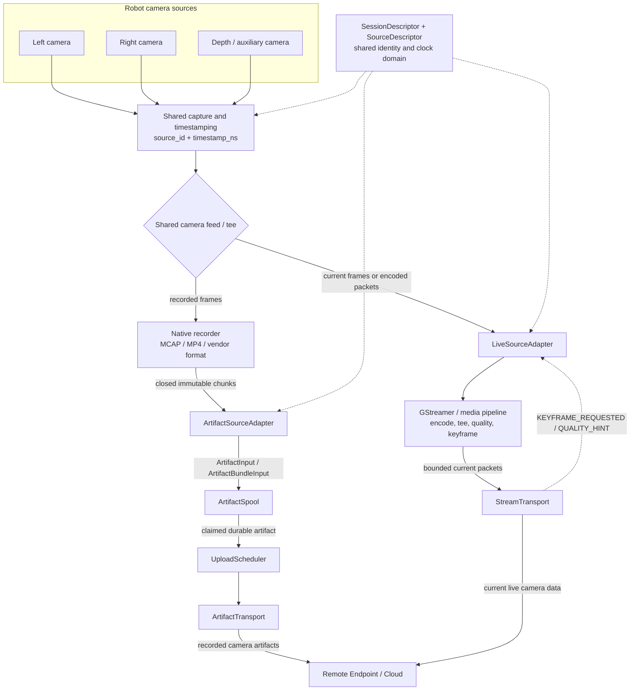
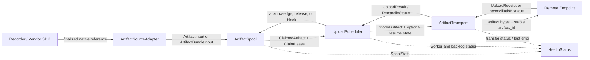
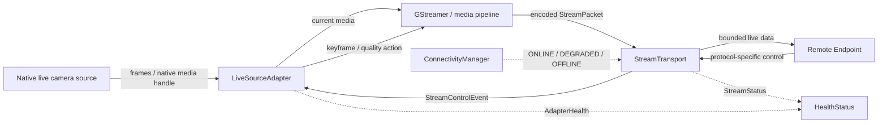
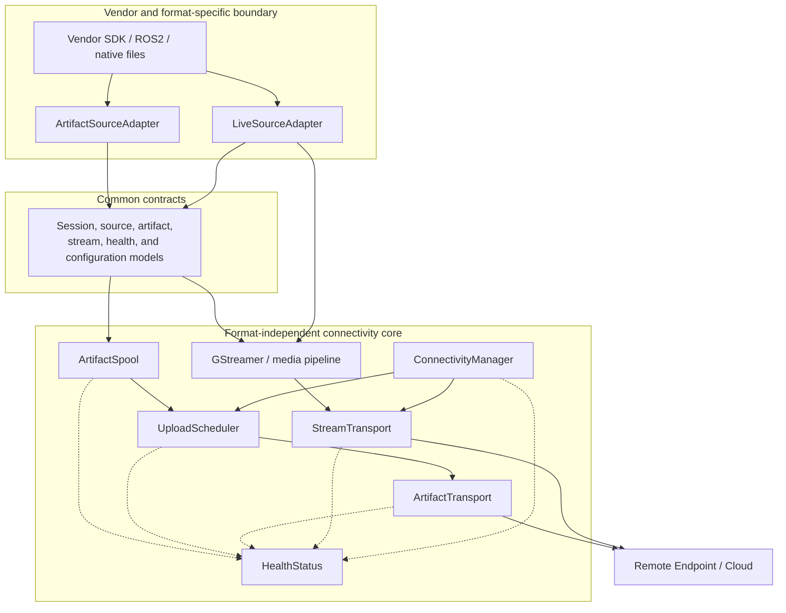
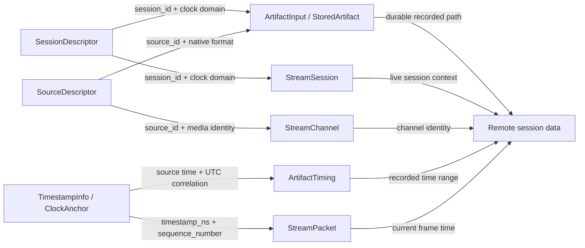
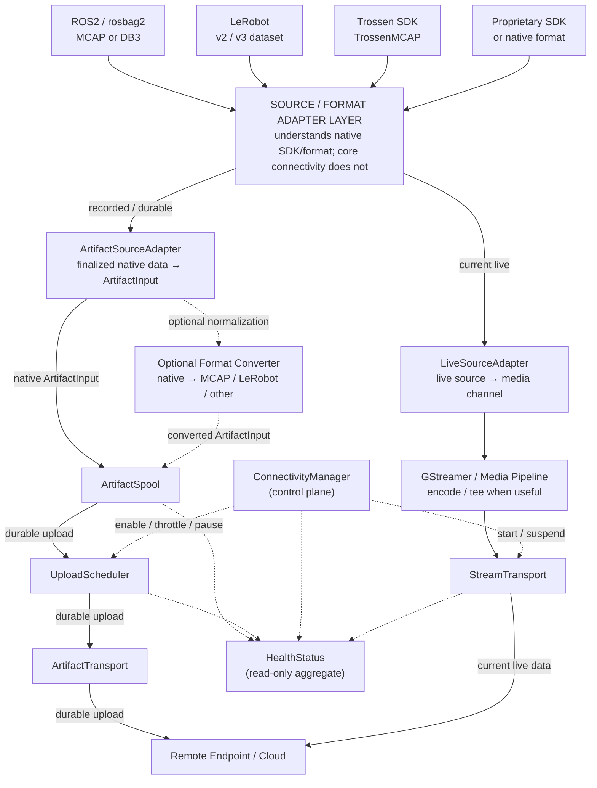
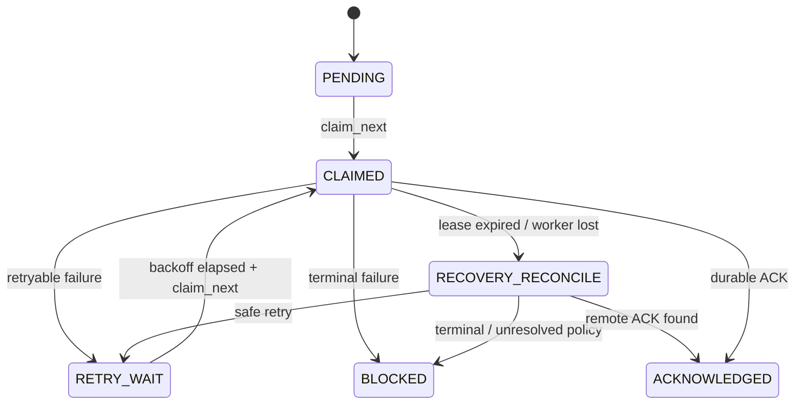
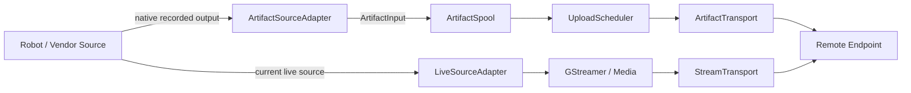
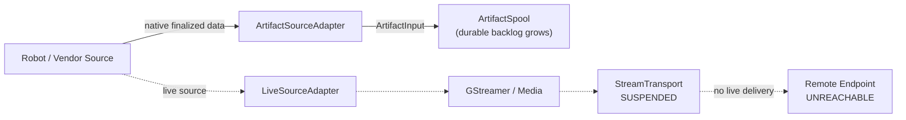
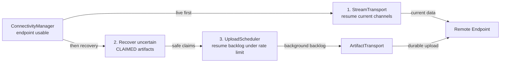

# V-Modal Robotics Connectivity Interface Specification

_Source/format adapters + durable store-and-forward + live multi-source transport_

| **Field** | **Value** |
| --- | --- |
| Document type | Phase 1 interface specification |
| Status | Proposed target architecture |
| Revision | 2.5 |
| Date | 12 September 2026 |
| Implementation intent | Format/vendor-agnostic connectivity with explicit adapters for ROS2/MCAP, LeRobot, Trossen, and proprietary robot sources, plus a design-only Python package/class/function skeleton. |

> **Scope principle:** Preserve native robot data formats by default, normalize only when needed, and keep connectivity contracts small, explicit, and vendor-independent.

## Architecture overview diagrams

These diagrams summarize the camera feed, data exchanged across the main interfaces, and the intentional coupling boundaries. Detailed normative contracts follow in the numbered sections.

### Integrated new camera data feed



The recorded and live paths share capture and encoding resources where practical. Only finalized recorded artifacts enter the durable spool; live delivery remains bounded and carries current data only.

### Data between components

#### Recorded and durable data exchange



#### Live data and control exchange



Recorded transfers exchange durable identities, leases, receipts, and reconciliation results. Live components exchange current packets and generic control events without creating a historical queue.

### Main component coupling

#### Runtime dependency boundaries



Solid arrows show allowed runtime dependencies or data movement. Dashed arrows into `HealthStatus` are observation-only; health reporting does not control the observed components.

#### Shared identity and timing coupling



The shared `session_id`, `source_id`, and timestamp domain couple recorded artifacts to live channels. Upload order, filenames, and arrival order are not synchronization contracts.

## 1. Scope and Design Position

This document defines how recorded and live robot data from heterogeneous robotics ecosystems connect to the V-Modal connectivity layer. Supported integration styles include ROS2/rosbag2, MCAP-based recorders, LeRobot datasets, Trossen SDK outputs, and proprietary vendor SDKs or native file formats. The specification defines adapter boundaries plus the durable and live connectivity contracts; it does not require every source to be converted into one universal format.

**ARC-01** Native robot data formats shall be connected through explicit source/format adapters rather than vendor-specific logic inside ArtifactSpool, ArtifactTransport, StreamTransport, or ConnectivityManager.

**ARC-02** Recorded data shall pass through ArtifactSpool before remote delivery, regardless of current connectivity state.

**ARC-03** The robot shall continue recording during connectivity loss while sufficient durable local storage remains available.

**ARC-04** Live delivery shall carry current data only. Historical/offline data shall be delivered through ArtifactTransport, not replayed through the live path.

**ARC-05** The core connectivity contracts shall not depend on one robot vendor, one recorded-data format, one cloud provider, or one live protocol.

**ARC-06** The logical separation between recorded and live paths shall not require duplicate camera capture or duplicate encoding. Implementations may share upstream capture and hardware-encoder resources when compatible.

**ARC-07** Format conversion is optional. A proprietary/native payload may be uploaded unchanged when the remote endpoint accepts it; normalization to MCAP, LeRobot, or another format belongs behind an adapter/converter boundary.

### 1.1 Normative language

Requirement identifiers (for example ADP-03, SP-05, or STR-09) are normative. "Shall" indicates required behavior for a conforming implementation. "Should" indicates a recommended default that may be changed by deployment policy.

## 2. Target Integration Architecture



*Figure 1 - Native ecosystems enter through source/format adapters; durable and live connectivity remain independent downstream paths.*

The Source / Format Adapter Layer is the only part of the architecture that needs to understand a robot vendor SDK or native storage format. Downstream connectivity components operate on common ArtifactInput / stream-channel contracts. This allows a new proprietary format to be integrated without modifying queueing, retry, reconnect, live transport, or health logic.

| **Area** | **Selected approach** | **Reason** |
| --- | --- | --- |
| Input integration | Source / Format Adapter Layer | Isolate ROS2, LeRobot, Trossen, and vendor-specific details from the connectivity core. |
| Recorded native data | Preserve native format by default | Avoid mandatory conversion cost and retain source fidelity. |
| Optional normalization | Adapter-side converter | Convert to MCAP/LeRobot/other only when the deployment or cloud requires it. |
| Durable local queue | ArtifactSpool | Single store-and-forward boundary for offline operation. |
| Recorded upload | ArtifactTransport | Remote-backend abstraction for finalized artifacts independent of native format. |
| Live media pipeline | GStreamer or equivalent | Use established capture/encode/tee functionality instead of rebuilding media plumbing. |
| Live delivery | StreamTransport | Small live transport contract around the selected endpoint/protocol. |
| Connectivity state | ConnectivityManager | One stable source of remote availability and degraded-state policy. |
| Operational state | HealthStatus | Read-only status surface for UI/alerts. |

## 3. Source / Format Adapter Interfaces

Adapters convert ecosystem-specific concepts into common connectivity contracts. They are intentionally thin: an adapter understands how to discover/finalize native data, extract source identity/timestamps/metadata, and hand off immutable payloads. It does not implement remote retry, spool retention, connectivity state, or cloud upload policy.

### 3.1 Adapter descriptors and capabilities

```text
AdapterDescriptor
  adapter_id: string
  vendor: string?
  capabilities: set<RECORDED_ARTIFACTS | LIVE_CHANNELS | NATIVE_METADATA | OPTIONAL_CONVERSION>
  native_format_ids: List<string>
ExternalArtifactRef
  native_id: string
  format_id: string
  group_id: string?
  finalized: bool
  metadata: map<string, scalar>
ArtifactBundleInput
  format_id: string
  group_id: string?
  members: List<ArtifactInput>
```

**ADP-01** Vendor- or format-specific parsing shall remain inside an adapter. Core connectivity components shall treat payload bytes as opaque except for common size/checksum/timing/identity metadata.

**ADP-02** Adapters shall expose a stable format_id such as rosbag2/mcap, lerobot/v3, trossen/mcap, or vendor-x/log-v2. The core shall not branch on hard-coded vendor names.

**ADP-03** Native payload preservation is the default. Conversion may be enabled when required, but shall not be a prerequisite for spooling or uploading a supported native format.

**ADP-04** An adapter shall not expose an actively growing or incomplete native object as ready. Finalization semantics are defined by that ecosystem (closed bag, finalized dataset shard, closed episode file, vendor completion callback, etc.).

**ADP-05** Multi-file datasets/bundles shall be represented using group_id plus relative_path on member artifacts so remote storage can reconstruct the native layout without forcing one archive/container format.

**ADP-06** Adapters shall be selected through configuration/registration rather than changes to ArtifactSpool or transport classes. Adding a new vendor format shall not require changes to the core durable or live state machines.

**ADP-07** If optional conversion fails, the adapter shall preserve the original native source unless policy explicitly permits otherwise; conversion failure shall not silently destroy the only source copy.

### 3.2 ArtifactSourceAdapter method contract

| **Method** | **Purpose** | **Inputs** | **Output / state effect** |
| --- | --- | --- | --- |
| open(config) | Initialize vendor SDK/parser/watch path and validate adapter configuration. | AdapterConfig | Result; adapter ready or explicit configuration/version error. |
| descriptor() | Describe adapter identity, capabilities, and native formats. | None | AdapterDescriptor. |
| discover_sources() | Identify recorded-data sources available through this adapter. | None | List&lt;SourceDescriptor&gt;. |
| list_ready(cursor?) | Enumerate finalized native objects not yet handed off. | Optional cursor/filter | List&lt;ExternalArtifactRef&gt;; no spool mutation. |
| prepare(ref) | Map/stage one finalized native object into common artifact member(s). | ExternalArtifactRef | ArtifactBundleInput; preserves native bytes by default. |
| confirm_handoff(ref, artifact_ids) | Confirm that returned member(s) were durably accepted by ArtifactSpool. | native ref + canonical artifact IDs | Result; adapter may release its temporary source ownership according to local policy. |
| close() | Release adapter resources. | None | Result. |

### 3.3 LiveSourceAdapter method contract

| **Method** | **Purpose** | **Inputs** | **Output / state effect** |
| --- | --- | --- | --- |
| open(config) | Initialize the native live-source SDK/topic bindings. | AdapterConfig | Result; adapter ready or explicit error. |
| descriptor() | Describe live capabilities and supported native sources. | None | AdapterDescriptor. |
| discover_channels() | Discover current live channels such as camera streams. | None | List&lt;SourceDescriptor / StreamChannel&gt;. |
| start(channel_id, media_sink) | Feed current media from the native source into the media pipeline/sink. | channel + MediaSink | LiveSourceHandle; no durable backlog is created. |
| handle_control(event) | Translate generic upstream control into native/media action when supported. | StreamControlEvent | Result; e.g. request keyframe/quality change. |
| stop(handle) | Stop one live source independently. | LiveSourceHandle | Result. |
| close() | Release native live-source resources. | None | Result. |

## 4. Reference Integration Paths

The following integrations demonstrate how the same adapter boundary accommodates established robotics stacks and proprietary formats without changing the downstream connectivity architecture.

| **Integration** | **Recorded path** | **Live path** | **Adapter responsibility** |
| --- | --- | --- | --- |
| ROS2 / rosbag2 | Finalized MCAP or DB3 bag / split segment | ROS image/compressed-image topics | Detect bag finalization; preserve storage format; map topic/source metadata and timestamps. |
| Generic MCAP | Finalized .mcap file | Source-dependent | Treat MCAP as native opaque artifact; optional schema/channel metadata extraction. |
| LeRobot v2 / v3 | MP4 + Parquet + metadata files/shards | Usually separate camera/live integration | Preserve dataset relative paths; use metadata rather than assuming one episode equals one file. |
| Trossen SDK | TrossenMCAP episode file | SDK/hardware callback path when required | Use generic MCAP handling plus optional Trossen metadata extraction; no mandatory conversion. |
| Proprietary file/bundle | Vendor file(s), directory members, sidecars | Vendor SDK callback / native media handle | Vendor adapter defines finalization, metadata mapping, group_id, relative paths, and live source binding. |

### 4.1 ROS2 / rosbag2 / MCAP

```text
ROS2 topics
-> rosbag2 recorder
-> finalized .mcap or .db3 bag segment
-> RosbagArtifactAdapter
-> ArtifactInput(format_id = "rosbag2/mcap" or "rosbag2/sqlite3")
-> ArtifactSpool
ROS2 camera topic
-> Ros2LiveSourceAdapter
-> GStreamer / media pipeline
-> StreamTransport
```

The adapter should use rosbag2 storage metadata and finalized bag/split boundaries rather than parsing camera frames solely for connectivity. MCAP is directly supported by rosbag2 through its MCAP storage plugin; SQLite3 bags can be preserved natively or converted outside the core when required.

### 4.2 LeRobot datasets

```text
LeRobot dataset root
-> LeRobotArtifactAdapter
-> finalized MP4 / Parquet / metadata shard(s)
-> ArtifactInput(group_id = dataset/shard identity, relative_path = native dataset path)
-> ArtifactSpool
```

The adapter shall be version-aware. LeRobot v3 stores multiple episodes in shared Parquet/MP4 shards and reconstructs episode views through metadata, so the connectivity layer must not assume that one episode maps to one physical file. Native dataset paths and grouping metadata are preserved during upload.

### 4.3 Trossen SDK / TrossenMCAP

```text
Trossen hardware / producers
-> Trossen backend
-> episode_XXXXXX.mcap (TrossenMCAP)
-> MCAP/Trossen ArtifactSourceAdapter
-> ArtifactInput(format_id = "trossen/mcap")
-> ArtifactSpool
Optional only:
TrossenMCAP -> Trossen converter -> LeRobot V2 -> ArtifactSourceAdapter
```

Trossen SDK is a useful reference because its hardware/producers/backends are registry-driven and its TrossenMCAP backend produces self-contained episode MCAP files. The V-Modal connectivity layer does not need to reproduce the Trossen recorder; it only needs an adapter that recognizes finalized output and common metadata. TrossenMCAP-to-LeRobot conversion remains an optional preprocessing choice, not a connectivity requirement.

### 4.4 Proprietary vendor formats

```text
Vendor recorder / SDK
-> finalized .vendorlog / native bundle / sidecar files
-> VendorArtifactAdapter
-> ArtifactInput(s) with format_id, group_id, relative_path, timestamps, checksum
-> ArtifactSpool -> ArtifactTransport
Vendor live callback / media handle
-> VendorLiveSourceAdapter
-> GStreamer / media pipeline
-> StreamTransport
```

For a single-file proprietary format, the adapter can pass the native finalized file unchanged. For a multi-file bundle, the adapter emits multiple ArtifactInput members with a shared group_id and native relative paths. For callback-only SDKs, the live adapter feeds the media pipeline directly; if durable recording is also required, a recorder/backend must first create finalized native or normalized artifacts for the ArtifactSourceAdapter.

Reference implementations reviewed:

- [Trossen Robotics SDK](https://github.com/TrossenRobotics/trossen_sdk)
- [Trossen data collection SDK](https://www.trossenrobotics.com/data-collection-sdk)
- [ROS 2 `rosbag2_storage_mcap`](https://docs.ros.org/en/ros2_packages/kilted/api/rosbag2_storage_mcap/)
- [LeRobot dataset v3](https://huggingface.co/docs/lerobot/lerobot-dataset-v3)

## 5. Core Connectivity Interface Set

| **#** | **Interface / Model** | **Primary responsibility** |
| --- | --- | --- |
| 1 | ArtifactSourceAdapter | Connect finalized native/proprietary recorded data to ArtifactInput without leaking format logic downstream. |
| 2 | LiveSourceAdapter | Connect native live sources/callbacks to the media/live transport path. |
| 3 | SessionDescriptor / SourceDescriptor | Identify a robot run, adapter, native format, and the sources that belong to it. |
| 4 | ArtifactSpool | Durably accept and retain finalized artifacts until remote acknowledgement. |
| 5 | ArtifactTransport | Transfer one durable artifact and reconcile uncertain remote outcomes. |
| 6 | UploadScheduler | Choose when and in what order spool items are uploaded and enforce shared-uplink limits. |
| 7 | StreamTransport | Deliver current multi-source live data with bounded latency. |
| 8 | ConnectivityManager | Publish stable ONLINE / DEGRADED / OFFLINE state and gate network work. |
| 9 | HealthStatus | Expose a read-only operational view and warning flags. |

## 6. Common Data Models

### 6.1 SessionDescriptor and SourceDescriptor

```text
SessionDescriptor
  session_id: string
  robot_id: string
  started_at_ns: int64
  timestamp_domain: TimestampDomain
  clock_anchor: ClockAnchor?
  sources: List<SourceDescriptor>
SourceDescriptor
  source_id: string
  source_type: video | telemetry | metadata | other
  name: string
  adapter_id: string
  native_format_id: string?
  format_or_codec: string
  metadata: map<string, scalar>
```

**DATA-01** session_id shall remain stable across temporary network disconnects. A reconnect creates a new transport connection, not a new logical robot session.

**DATA-02** Camera identity shall be represented by source_id/channel identity. Camera-specific API methods such as send_left_camera() shall not be part of the core interface.

**DATA-03** adapter_id identifies which integration adapter owns source-specific interpretation; native_format_id identifies the source format when applicable.

### 6.2 Timestamp and synchronization

```text
TimestampDomain
ROBOT_MONOTONIC | ROS_TIME | UTC_EPOCH | OTHER
TimestampInfo
  timestamp_ns: int64
  timestamp_domain: TimestampDomain
  sequence_number: uint64
ArtifactTiming
  start_timestamp_ns: int64
  end_timestamp_ns: int64
  timestamp_domain: TimestampDomain
ClockAnchor
  source_timestamp_ns: int64
  utc_epoch_ns: int64
  uncertainty_ns: uint64?
```

**TIME-01** All sources in the same session should be normalized to a common robot-side timestamp domain before data enters the spool or live transport when the source ecosystem provides sufficient timing information.

**TIME-02** Cross-source synchronization shall use timestamps and source identity, not file arrival order or upload order.

**TIME-03** Transport layers shall preserve source timestamps and shall not replace them with remote arrival time.

**TIME-04** When the session timestamp domain is not UTC_EPOCH and wall-clock correlation is required, SessionDescriptor shall provide a ClockAnchor that maps one source-clock instant to UTC.

**TIME-05** Long-running deployments may refresh ClockAnchor values when drift correction is required; relative cross-source synchronization shall continue to use the common source timestamp domain.

Design note - A proprietary adapter may expose vendor-native timestamp metadata in addition to the common fields. Hardware triggering, PTP, or tighter drift compensation remain deployment-specific.

### 6.3 Adapter input versus spool-owned artifact

```text
ArtifactInput
  session_id: string
  source_id: string
  artifact_type: string
  format_id: string
  group_id: string?
  relative_path: string?
  source_path: string
  size_bytes: uint64
  checksum_sha256: string
  timing: ArtifactTiming
  metadata: map<string, scalar>
StoredArtifact
  artifact_id: string
  session_id: string
  source_id: string
  artifact_type: string
  format_id: string
  group_id: string?
  relative_path: string?
  spool_ref: string
  size_bytes: uint64
  checksum_sha256: string
  timing: ArtifactTiming
  metadata: map<string, scalar>
  state: ArtifactState
```

**DATA-04** source_path identifies adapter/producer-owned finalized data before acceptance. spool_ref identifies spool-owned durable data after successful put().

**DATA-05** artifact_id shall be stable across retries and process restarts and shall be used as the remote idempotency/reconciliation identity.

**DATA-06** ArtifactSpool.put() shall be idempotent for the same logical finalized artifact. A repeated handoff after a lost local response shall return the same artifact_id rather than create duplicate spool records.

**DATA-07** format_id, group_id, and relative_path shall be preserved through spooling/upload so the remote side can retain or reconstruct native multi-file dataset layouts.

**DATA-08** Core spool/transport logic shall not require knowledge of the internal schema of a proprietary payload. Format-specific interpretation belongs to the adapter or remote consumer.

## 7. Producer / Adapter Handoff and Finalization Contract

The connectivity layer does not define how a camera is captured or how a vendor recorder internally writes data. It defines the handoff condition that makes adapter output safe for ArtifactSpool.

```text
ProducerOrAdapterHandoff
finalize(native_source) -> ArtifactBundleInput
# durable ownership transfer occurs through ArtifactSpool.put(member) for each finalized member
```

**PROD-01** Only closed, immutable artifacts shall be admitted to ArtifactSpool.

**PROD-02** Before handoff, the adapter/producer shall finalize byte length, checksum, time range when available, session_id, source_id, and format_id.

**PROD-03** Video should be recorded in deployment-configurable chunks or finalized dataset shards rather than one unbounded file.

**PROD-04** Left and right camera artifacts may finalize independently and in parallel. They remain separate artifacts associated by session_id, source_id, timestamps, and optional group_id.

**PROD-05** After ArtifactSpool.put() confirms durable acceptance, the adapter/producer may release its own temporary ownership/copy according to local policy.

**PROD-06** Large-file spool ingestion shall execute outside real-time camera capture callbacks/threads so durable handoff cannot stall frame acquisition.

**PROD-07** A conforming implementation shall not require a second encoder for live delivery when a compatible encoded stream can be shared. A media pipeline may tee or otherwise share capture/encoding resources before durable and live branches diverge.

**PROD-08** Chunk/file boundaries need not align across sources. Cross-source association shall use session/source/timestamps; format-specific manifests may be emitted as ordinary metadata artifacts when required by the native dataset format.

## 8. ArtifactSpool Interface

ArtifactSpool is the durable handoff boundary between adapter/producer output and network delivery. Once an artifact is accepted, network availability and native format interpretation are no longer the producer’s concern.

### 8.1 State model



*Figure 2 - Durable artifact states plus lease-expiry / uncertain-outcome recovery.*

```text
ArtifactState = PENDING | CLAIMED | RETRY_WAIT | ACKNOWLEDGED | BLOCKED
ClaimLease
  claim_token: string
  claimed_at_ns: int64
  lease_deadline_ns: int64
# local monotonic lease clock; values are not compared across process restarts
ClaimedArtifact
  artifact: StoredArtifact
  lease: ClaimLease
ClaimLeasePolicy
  lease_duration_ms: uint64
  renew_before_expiry_ms: uint64
```

### 8.2 Method contract

| **Method** | **Purpose** | **Inputs** | **Output / state effect** |
| --- | --- | --- | --- |
| put(input) | Ingest a finalized producer artifact and commit immutable spool-owned bytes durably. | ArtifactInput | PutResult + canonical artifact_id; creates PENDING only after durable commit. |
| claim_next(filter?) | Atomically reserve one eligible artifact for an upload worker. | Optional lane/type/source filter | ClaimedArtifact?; eligible PENDING or elapsed RETRY_WAIT -&gt; CLAIMED with a persisted ClaimLease. |
| renew_claim(id, token, extend_by) | Extend ownership for a healthy long-running upload worker before its lease expires. | artifact_id, claim_token, lease extension | ClaimLease; state remains CLAIMED with a later lease_deadline_ns. |
| list_claimed(filter?) | Expose unresolved or lease-expired claims for recovery/reconciliation. | None or filter | List&lt;ClaimedArtifact&gt;; includes persisted claim token/deadline; no state change. |
| acknowledge(id, claim_token, receipt) | Commit a durable remote acknowledgement. | artifact_id, claim_token, UploadReceipt | CLAIMED -&gt; ACKNOWLEDGED; stores remote reference/checksum. |
| release(id, claim_token, retry_after, reason) | Return a retryable failure to the queue. | artifact_id, claim_token, delay, reason | CLAIMED -&gt; RETRY_WAIT; eligible for claim_next after backoff. |
| block(id, reason, claim_token?) | Stop automatic retries for a terminal artifact failure. | artifact_id, reason, optional claim_token | CLAIMED/PENDING -&gt; BLOCKED; a valid token is required when the current state is CLAIMED. |
| get(id) | Read one spool record. | artifact_id | StoredArtifact; no state change. |
| list_pending(filter?) | Inspect queued/retryable backlog. | Optional filter | List&lt;StoredArtifact&gt;; no state change. |
| stats() | Report durable queue/capacity state. | None | SpoolStats; no state change. |
| cleanup_acknowledged(policy) | Delete spool payloads that are already safe to remove. | CleanupPolicy | CleanupResult; unacknowledged data is preserved. |
| export(path, filter?, verify=true) | Copy selected spool data to external/manual storage. | Destination + filter | ExportResult; optional local removal only after verification. |

**SP-01** claim_next() shall be atomic so two workers cannot claim the same artifact concurrently.

**SP-02** put() shall not return success until the spool-owned payload and spool state are durably committed.

**SP-03** Unacknowledged artifacts shall not be silently deleted by normal retention behavior.

**SP-04** Manual cleanup shall target acknowledged/safely disposable data by default.

**SP-05** Manual export shall follow copy -> checksum verification -> export confirmation -> optional local removal. Pending data shall not be removed before verification succeeds.

**SP-06** On startup, unresolved CLAIMED items shall be exposed for reconciliation before they are blindly re-uploaded.

**SP-07** put() shall define durability/immutability semantics, not a mandatory filesystem primitive. Byte copy, reflink, atomic move, or equivalent optimization may be used only when ownership, checksum integrity, crash durability, and source immutability are preserved.

**SP-08** A CLAIMED artifact whose lease expires shall be treated as an uncertain remote outcome and reconciled before duplicate-prone retry.

**SP-09** Claim tokens and CLAIMED ownership state shall be persisted so stale workers cannot acknowledge or release superseded claims.

**SP-10** Lease expiry does not by itself prove upload failure and shall not silently change CLAIMED to PENDING; recovery must resolve or safely classify the remote outcome first.

**SP-11** ArtifactSpool shall preserve format_id, group_id, and relative_path without requiring a parser for that native format.

## 9. Spool Capacity and Recording Stop Policy

```text
SpoolCapacity
  backing_filesystem_id: string?
  filesystem_used_bytes: uint64
  filesystem_free_bytes: uint64
  filesystem_capacity_bytes: uint64
  spool_owned_bytes: uint64
  usage_ratio: float
  storage_warning: bool
  storage_full: bool
StoragePolicy
  warning_threshold: float
  stop_threshold: float
  reserved_finalize_bytes: uint64
```

**CAP-01** warning_threshold and stop_threshold shall be evaluated against the backing filesystem/volume capacity and free space, not only logical spool-owned bytes.

**CAP-02** reserved_finalize_bytes shall cover all currently active recording sources plus an implementation safety margin.

**CAP-03** At stop_threshold for a storage volume required by recording/spooling, the controller shall stop starting new chunks, finalize active chunks that fit within reserve, and then stop recording until capacity becomes available.

**CAP-04** ArtifactSpool reports capacity/acceptance state. It shall not directly control cameras or recording.

**CAP-05** The default policy shall not silently overwrite old unacknowledged robot data to make space.

**CAP-06** Backing-filesystem accounting shall include space consumed by active producer chunks, temporary files, spool data, and unrelated files on the same volume.

**CAP-07** source_path and spool_ref are not required to share a filesystem. If producer-active files and spool-owned files reside on different volumes, both volumes shall be monitored according to the operations that depend on them.

**CAP-08** StoragePolicy shall satisfy 0 <= warning_threshold < stop_threshold <= 1.0; reserved_finalize_bytes is an absolute byte reserve, not an additional ratio threshold.

## 10. ArtifactTransport Interface

ArtifactTransport transfers one spool-owned artifact to the remote endpoint. It does not parse the native data format, own the queue, choose upload order, or delete local data.

```text
UploadStatus = ACKNOWLEDGED | RETRYABLE_FAILURE | TERMINAL_FAILURE | CANCELLED
ReconcileStatus = ACKNOWLEDGED | NOT_FOUND | UNKNOWN | TERMINAL_FAILURE
```

| **Method** | **Purpose** | **Inputs** | **Output / state effect** |
| --- | --- | --- | --- |
| open(config) | Initialize remote client/session and validate transport configuration. | TransportConfig | Result; transport becomes ready or returns configuration/auth error. |
| upload(artifact, resume_state?) | Deliver one durable artifact using artifact_id as stable remote identity. | StoredArtifact + optional serialized resume bytes | UploadResult; does not mutate spool directly. |
| reconcile(artifact) | Resolve an uncertain prior upload after crash/lost response. | StoredArtifact | ReconcileStatus + remote receipt when known. |
| cancel(artifact_id) | Request cancellation of an active upload. | artifact_id | Result; caller decides whether spool item is retried. |
| status() | Report transport readiness/current transfer state. | None | TransportStatus. |
| close() | Release transport resources cleanly. | None | Result; no spool mutation. |

**TR-01** A successful upload shall provide a durable acknowledgement before ArtifactSpool marks the artifact ACKNOWLEDGED.

**TR-02** Upload attempts shall use stable artifact_id as an idempotency key where the remote endpoint supports idempotent creation.

**TR-03** After a process crash or lost acknowledgement, the scheduler shall call reconcile() for unresolved CLAIMED items when reconciliation is supported.

**TR-04** A conforming implementation shall provide duplicate-safe recovery through remote idempotency, reconciliation, or both. Blind non-idempotent retry is not sufficient for lost-ACK recovery.

**TR-05** Resumable/multipart upload may be implemented when supported by the endpoint. Resume-state meaning remains transport-private.

**TR-06** Transport credentials and endpoint configuration shall not be embedded in StoredArtifact records.

**TR-07** Any resume state that must survive a process restart shall be represented as serialized bytes or another explicitly serializable token format.

**TR-08** ArtifactTransport shall transport native/proprietary artifacts without requiring format-specific decoding. Remote routing may use format_id and metadata.

## 11. UploadScheduler Interface

| **Method** | **Purpose** | **Inputs** | **Output / state effect** |
| --- | --- | --- | --- |
| start() | Start upload workers after configuration and recovery. | None | Result; workers active when connectivity policy permits. |
| pause() | Stop claiming new artifacts while allowing local recording/spooling to continue. | None | Result; scheduler paused. |
| resume() | Allow workers to claim and upload eligible backlog. | None | Result; scheduler running. |
| recover_uncertain() | Reconcile lease-expired or startup-unresolved CLAIMED spool items. | None | RecoveryResult; ACKNOWLEDGED, duplicate-safe RETRY_WAIT/PENDING, or BLOCKED/operator-attention if the remote outcome stays unknown. |
| set_limits(concurrency, max_upload_bps?) | Apply deployment concurrency and aggregate artifact-upload rate limits. | Worker count + optional bytes/second limit | Result; limits apply to active/future artifact transfers. |
| get_status() | Expose worker/backlog state. | None | UploadSchedulerStatus. |
| stop() | Stop workers and release claims cleanly where possible. | None | Result; no new claims. |

**SCH-01** After reconnect, live streaming shall receive priority over backlog upload.

**SCH-02** Artifact backlog shall drain in the background using configured concurrency/bandwidth limits.

**SCH-03** Default priority should be metadata/control, then telemetry, then video; within equal priority, oldest-first ordering should be used.

**SCH-04** Left and right camera artifacts shall have equal default priority. Upload order shall not define synchronization order.

**SCH-05** The scheduler should avoid indefinite starvation of lower-priority artifacts.

**SCH-06** Startup recovery shall complete reconciliation of uncertain CLAIMED items before normal duplicate-prone retry.

**SCH-07** When live streaming is active, the scheduler shall enforce a configured artifact-upload bandwidth budget or pause background uploads so artifact transfer cannot consume the entire shared uplink.

**SCH-08** When ConnectivityManager or StreamTransport reports DEGRADED live operation, deployment policy should further throttle or temporarily pause backlog upload. OS/socket QoS may supplement this behavior but is not required by the core interface.

**SCH-09** max_upload_bps, when configured, shall limit aggregate bytes transferred by all active ArtifactTransport uploads rather than only admission of new workers.

## 12. StreamTransport Interface

StreamTransport is the low-latency, non-durable path for current live data. Native source acquisition belongs to LiveSourceAdapter; GStreamer (or an equivalent media pipeline) handles capture/encoding; StreamTransport handles remote delivery and protocol-specific signaling.

```text
StreamSession
  session_id: string
  robot_id: string
  timestamp_domain: TimestampDomain
  channels: List<StreamChannel>
StreamChannel
  channel_id: string
  source_id: string
  media_type: string
  codec: string
  width: uint32?
  height: uint32?
  frame_rate: float?
StreamPacket
  session_id: string
  channel_id: string
  timestamp_ns: int64
  sequence_number: uint64
  payload: bytes
  flags: set
SendStatus
ACCEPTED | DROPPED | BACKPRESSURE | DISCONNECTED
StreamControlEventType
REMOTE_CONNECTED | REMOTE_DISCONNECTED | KEYFRAME_REQUESTED | QUALITY_HINT
```

| **Method** | **Purpose** | **Inputs** | **Output / state effect** |
| --- | --- | --- | --- |
| open(config) | Initialize live endpoint/protocol resources. | StreamTransportConfig | Result; ready or error. |
| start_session(desc) | Start one logical live session without creating a new robot SessionDescriptor. | StreamSession | StreamHandle. |
| add_channel(handle, desc) | Register a source/channel such as left or right camera. | StreamHandle + StreamChannel | ChannelHandle. |
| send(channel, packet) | Submit current encoded media to the bounded live-delivery path. | ChannelHandle + StreamPacket | SendResult; never creates an unbounded queue or blocks indefinitely. |
| remove_channel(channel) | Stop one channel independently. | ChannelHandle | Result. |
| end_session(handle) | End current live transport session. | StreamHandle | Result; logical robot session may continue for reconnect. |
| status(handle) | Read live transport state/quality counters. | StreamHandle | StreamStatus. |
| subscribe_control(cb) | Receive protocol-independent upstream control events from the remote/live transport. | Control-event callback | SubscriptionHandle; no media ownership change. |
| close() | Release transport resources. | None | Result. |

**STR-01** The interface shall support multiple logical channels without camera-specific methods.

**STR-02** A concrete implementation may map channels to one multiplexed connection or multiple connections; that choice shall not leak into the session model.

**STR-03** On network loss, live delivery shall stop/suspend. Missed data shall not accumulate in an unbounded StreamTransport queue.

**STR-04** After reconnect, live delivery resumes with current data. Historical/offline data remains the responsibility of ArtifactTransport.

**STR-05** Live buffering shall be bounded and send() shall report ACCEPTED, DROPPED, BACKPRESSURE, or DISCONNECTED when the transport cannot accept data normally.

**STR-06** Where practical, StreamTransport should consume already encoded packets and should not implement video codecs itself.

**STR-07** The default congestion policy should favor freshness over stale live video. Codec-aware dropping, rate reduction, or drop-until-keyframe behavior should be implemented in the media pipeline rather than arbitrarily discarding dependent encoded packets.

**STR-08** send() shall be non-blocking or bounded-time from the caller perspective; a saturated network path shall signal backpressure/drop status instead of propagating an unbounded memory queue.

**STR-09** Protocol-specific signaling shall remain inside the concrete StreamTransport. Actionable remote needs shall be translated into generic StreamControlEvent values rather than exposing protocol-specific signaling in the core interface.

**STR-10** When the selected live protocol requests decoder refresh or a newly connected receiver requires a refresh frame, StreamTransport shall emit KEYFRAME_REQUESTED for the affected channel so LiveSourceAdapter/media pipeline can request an IDR/keyframe when supported.

## 13. ConnectivityManager Interface

```text
ConnectivityState = OFFLINE | CONNECTING | ONLINE | DEGRADED
```

| **Method** | **Purpose** | **Inputs** | **Output / state effect** |
| --- | --- | --- | --- |
| start(config) | Start periodic/local connectivity evaluation. | ConnectivityConfig | Result; state machine active. |
| get_state() | Return the current stable connectivity state. | None | ConnectivityState. |
| get_status() | Return diagnostic detail behind the state. | None | ConnectivityStatus. |
| subscribe(listener) | Receive state transition events. | Listener/callback | SubscriptionHandle. |
| force_check() | Request an immediate remote usability check. | None | ConnectivityStatus. |
| stop() | Stop checks and subscriptions. | None | Result. |

**CONN-01** ONLINE shall mean the configured remote endpoint is usable, not merely that Wi-Fi/Ethernet exists.

**CONN-02** Connectivity state should use hysteresis or consecutive success/failure thresholds to avoid rapid state flapping.

**CONN-03** ConnectivityManager publishes state; it shall not upload artifacts or carry live media itself.

**CONN-04** ONLINE enables live transport and upload scheduling. OFFLINE suspends live delivery and pauses new upload claims while ArtifactSpool continues accepting finalized data.

**CONN-05** DEGRADED may keep live streaming active while throttling backlog upload or lowering stream quality when supported.

## 14. Reconnect and Recovery Behavior

Reconnect data flow is shown in Section 18.3 (Figure 5); this section defines the normative recovery ordering.

**REC-01** A temporary disconnect shall not create a new logical SessionDescriptor.

**REC-02** Backlog data shall never be replayed through the live-stream interface.

**REC-03** On connectivity recovery: (1) verify endpoint/handshake, (2) restore current live channels, (3) recover uncertain artifact claims, and (4) resume normal backlog draining in the background.

**REC-04** Live traffic shall be protected from backlog saturation through enforced scheduler bandwidth/concurrency limits; DEGRADED live health may trigger stronger throttling or a temporary backlog pause.

## 15. HealthStatus Interface

```text
SystemHealth
  overall_state: HEALTHY | WARNING | ERROR
  connectivity: ConnectivityHealth
  adapters: List<AdapterHealth>
  spool: SpoolHealth
  artifact_transport: ArtifactTransportHealth
  stream_transport: StreamHealth
  active_session_id: string?
  last_error: ErrorInfo?
```

| **Method** | **Purpose** | **Inputs** | **Output / state effect** |
| --- | --- | --- | --- |
| get_health() | Return one read-only snapshot of the connectivity pipeline. | None | SystemHealth. |
| subscribe(listener) | Receive health/warning changes. | Listener/callback | SubscriptionHandle. |

**HLTH-01** HealthStatus shall be read-only and shall not directly control adapters, recording, or transports.

**HLTH-02** At minimum it shall expose adapter readiness/errors, backing-filesystem free/capacity bytes, spool-owned bytes, storage_warning, storage_full, pending artifact count, connectivity state, live stream state, and last transfer error.

**HLTH-03** The model shall be simple enough to expose through an SDK method or lightweight JSON/HTTP endpoint without requiring a separate monitoring platform.

## 16. Configuration and Security

```text
SystemConfig
device_identity
  adapter_configs: List<AdapterConfig>
remote_endpoint
credentials_ref
spool_config
recording_config
upload_config
stream_config
connectivity_config
AdapterConfig
  adapter_id: string
  adapter_type: string
  vendor_options: map<string, scalar/string>
  conversion_policy: NATIVE | NORMALIZE_OPTIONAL | NORMALIZE_REQUIRED
DeviceIdentity
  robot_id: string
  device_id: string
```

**CFG-01** Runtime configuration shall be external to the core interfaces and should be loadable from a simple YAML/JSON source.

**CFG-02** Adapter selection and vendor-specific options shall live in adapter configuration; core transport code shall not contain vendor dispatch logic.

**CFG-03** Credentials shall be referenced externally and shall not be stored in artifacts, session metadata, or spool payload metadata.

**CFG-04** Remote transports shall use authenticated encrypted communication where supported by the selected endpoint/protocol.

**CFG-05** Configuration shall be validated before startup so unsupported adapter/format versions, impossible storage thresholds, invalid endpoints, or missing credentials fail early.

## 17. Failure Semantics, Critical Failure Points, and Coupling Risks

### 17.1 Detailed failure matrix

| **Failure / event** | **Classification** | **Required behavior** |
| --- | --- | --- |
| Network unavailable / timeout | Retryable | Keep artifact durable; pause/retry according to policy. Live path suspends without unbounded buffering. |
| Remote 5xx / temporary endpoint failure | Retryable | Return artifact to RETRY_WAIT with bounded backoff. |
| Authentication / authorization failure | Operator/config error | Expose in HealthStatus; avoid repeated bandwidth-consuming retry until policy/config changes. |
| Checksum mismatch / corrupt artifact | Terminal data error | BLOCK the specific artifact and expose reason; do not delete it silently. |
| Upload stored remotely but ACK lost | Uncertain remote outcome | On restart/retry, reconcile by artifact_id or use remote idempotency before duplicate-prone upload. |
| Process crashes with CLAIMED item | Recovery | Persist claim state; list_claimed() + ArtifactTransport.reconcile() resolves ACKNOWLEDGED / NOT_FOUND / UNKNOWN. |
| Duplicate client retry | Idempotency case | Remote identity shall use stable artifact_id where supported so the same logical artifact is not created twice. |
| Spool warning threshold reached | Capacity warning | Set storage_warning=true; continue recording while reserve remains. |
| Spool stop threshold reached | Capacity stop | Stop starting new chunks; finalize all active source chunks using reserved capacity; stop recording afterward. |
| Manual export interrupted | Maintenance failure | Keep local source intact unless export checksum verification completed. |
| Live network congestion | Live degradation | Use bounded buffer and configured drop/rate/quality policy; do not turn live path into backlog storage. |
| Upload worker hangs / claim lease expires | Recovery / uncertain outcome | Keep the item CLAIMED/uncertain, invalidate the stale claim token, reconcile the remote outcome, then ACKNOWLEDGE, retry safely, or BLOCK according to the result. |
| Live send queue reaches capacity | Live backpressure | Return DROPPED/BACKPRESSURE explicitly; keep the queue bounded and favor fresh decodable media through codec-aware pipeline policy. |
| Backlog upload degrades live stream | Shared-uplink contention | Throttle or pause ArtifactTransport through UploadScheduler according to configured bandwidth budget and live health state. |
| Non-UTC source clock requires wall-time correlation | Timing / correlation | Provide a ClockAnchor mapping source_timestamp_ns to utc_epoch_ns; refresh anchors when long-session drift correction is required. |
| Backing filesystem fills from active/temp/other files | Capacity stop | Evaluate real filesystem free space rather than logical spool bytes; stop new recording chunks before reserved finalization space is violated. |
| Remote receiver requests decoder refresh | Live control | Translate protocol-specific request into KEYFRAME_REQUESTED for the affected channel; upstream media pipeline performs codec-appropriate refresh when supported. |
| Native object still open / growing | Adapter readiness | Do not expose it as ready and do not call ArtifactSpool.put(); wait for native finalization/close signal. |
| Unsupported proprietary format/version | Adapter/config error | Reject adapter startup or source discovery with explicit format/version detail; core transports remain unaffected. |
| Adapter metadata parse failure | Adapter/data error | Preserve native source; expose error in AdapterHealth; do not fabricate timestamps/schema. Native opaque upload may continue only if deployment policy explicitly allows it. |
| Optional format conversion fails | Conversion error | Preserve native source and report conversion failure. Fall back to native upload only when conversion policy permits; never delete the sole native copy. |
| Multi-file bundle partially finalized | Adapter readiness | Expose only finalized members; preserve group_id/relative_path. Do not mark a group complete until native completion semantics are satisfied when group completion matters. |

### 17.2 Critical failure points

The following failures are the highest-risk integration points because they can cause data loss, duplicate remote state, indefinite backlog, or unusable live media. They are called out separately from the detailed matrix so implementation reviews can verify ownership and mitigation directly.

| **Critical failure point** | **Why it is critical** | **Required owner / response** |
| --- | --- | --- |
| Backing-volume exhaustion | Active recorder files, spool payloads, and unrelated files can consume the same volume and invalidate logical spool-only accounting. | ArtifactSpool/StoragePolicy must use real filesystem free space; stop new chunks before finalization reserve is violated. |
| Incomplete or falsely finalized native object | A vendor file/bundle exposed while still growing can be copied/uploaded as a corrupt or internally inconsistent artifact. | ArtifactSourceAdapter owns readiness/finalization checks; only immutable finalized members may reach ArtifactSpool.put(). |
| Lost ACK / duplicate remote creation | Remote storage may succeed while the client loses the response, making a blind retry duplicate the logical artifact. | ArtifactTransport + UploadScheduler must use stable artifact_id and reconcile/idempotency before duplicate-prone retry. |
| Expired or abandoned upload claim | A crashed/hung worker can strand an artifact in CLAIMED or allow a stale worker to mutate state after ownership changes. | Persist claim token/lease; invalidate stale ownership; recover through reconcile before ACKNOWLEDGED, RETRY_WAIT, or BLOCKED. |
| Partial multi-file native bundle | Uploading only part of a dataset may produce a remote group that cannot be reconstructed or interpreted correctly. | Adapter preserves group_id/relative_path and native completion semantics; incomplete members/groups remain unready. |
| Shared-uplink starvation | Background artifact upload can consume LTE/Wi-Fi capacity and destroy live latency even when logical stream priority exists. | UploadScheduler enforces aggregate max_upload_bps and may throttle/pause backlog when live health is degraded. |
| Live decoder desynchronization / control loss | Packet loss or a new receiver can require a refresh frame; without an upstream control path the remote stream may stay undecodable. | StreamTransport emits protocol-independent KEYFRAME_REQUESTED; LiveSourceAdapter/media pipeline performs the supported refresh action. |
| Unsupported proprietary format/version | A vendor SDK or file schema can change without the core pipeline understanding it, leading to silent misinterpretation. | Adapter validates version/capabilities at open/discovery and reports explicit adapter/config errors; core spool/transport remain format-opaque. |

### 17.3 Critical coupling issues

The architecture intentionally permits a small number of explicit couplings. A conforming implementation should keep these dependencies at the listed contract boundary and avoid leaking vendor, transport, or storage details across layers.

| **Coupling boundary** | **Allowed / required dependency** | **Coupling to avoid** |
| --- | --- | --- |
| Source/Format Adapter -&gt; common artifact models | Required: adapter maps native concepts to ArtifactInput/ArtifactBundleInput and format metadata. | ArtifactSpool must not import vendor SDK types or parse proprietary payload schemas. |
| LiveSourceAdapter -&gt; media pipeline / StreamTransport | Required: live source feeds current media and handles generic StreamControlEvent requests. | Vendor live callbacks must not own remote protocol state; StreamTransport must not own camera/vendor SDK lifecycles. |
| ArtifactSpool -&gt; backing filesystem | Required operational coupling: durability, atomic commit, free-space accounting, and immutable spool ownership depend on the actual volume. | Do not base stop/warning decisions only on summed spool payload bytes or assume producer/spool paths share one filesystem. |
| UploadScheduler -&gt; ArtifactTransport | Required: scheduler chooses claims/order/rate and invokes upload/reconcile. | ArtifactTransport must not claim/delete spool items or independently implement queue policy. |
| ConnectivityManager -&gt; UploadScheduler / StreamTransport | Required control coupling: connectivity state enables, pauses, or degrades network activity. | ConnectivityManager must not carry artifact bytes/media or become a second queue/orchestrator. |
| Session/source identity -&gt; artifacts and live channels | Required semantic coupling: session_id/source_id/timestamps associate multi-camera and multimodal data. | Do not infer synchronization from upload order, filenames, or arrival order. |
| Remote endpoint -&gt; idempotency/reconciliation contract | Required for duplicate-safe uncertain-outcome recovery. | Do not expose backend-specific APIs above ArtifactTransport or require adapters/spool to understand cloud response formats. |
| HealthStatus -&gt; all subsystems | Observation-only coupling: health aggregates adapter, storage, upload, connectivity, and stream status. | HealthStatus must not become a control plane that mutates component state. |

## 18. End-to-End Data Flows

### 18.1 Online operation



*Figure 3 - Native sources enter through adapters; durable artifacts always pass through the spool while live data takes the low-latency path.*

### 18.2 Offline operation



*Figure 4 - Recorded/native artifacts continue into durable local storage while live delivery is suspended.*

### 18.3 Reconnect operation



*Figure 5 - Current live channels resume first; uncertain claims are reconciled; durable backlog then drains under the configured rate limit.*

### 18.4 Manual storage evacuation

```text
Operator requests export
-> ArtifactSpool copies selected native/normalized artifacts to external storage
-> destination checksums are verified
-> group_id / relative_path are preserved
-> export is confirmed
-> optional local removal occurs only under explicit policy
```

## 19. Mapping from Current V-Modal Repository to Target Interfaces

The current repository is implementation context, not an architectural constraint. The revised target preserves useful durable-upload concepts while making the previously LeRobot-specific entry point one implementation of a broader adapter contract.

| **Current repository concept/class** | **Target architecture mapping** | **Decision** |
| --- | --- | --- |
| LeRobotAdapter | ArtifactSourceAdapter implementation (LeRobot) | Refactor behind the generic adapter contract. Preserve LeRobot-specific dataset interpretation inside this adapter, not in ArtifactSpool/Runner. |
| No generic current equivalent | ArtifactSourceAdapter interface | New integration boundary for ROS2/MCAP, Trossen, proprietary files/bundles, and future formats. |
| No generic current equivalent | LiveSourceAdapter interface | New source boundary for ROS topics or vendor SDK live callbacks before GStreamer/StreamTransport. |
| Spool | ArtifactSpool | Reuse/refactor durable spool implementation behind the target contract; remain format-opaque. |
| Runner | UploadScheduler + startup recovery orchestration | Split scheduling/retry/recovery responsibility from transport implementation. |
| VmodalTransport | ArtifactTransport implementation | Keep V-Modal-specific remote calls behind the generic artifact transport contract. |
| No current equivalent | StreamTransport | New live-media delivery contract. |
| No current equivalent | ConnectivityManager | New control-plane state machine for remote usability. |
| Current status data is distributed | HealthStatus | Aggregate adapter/connectivity/spool/transport status without changing subsystem ownership. |

## 20. Proposed Python Code Structure (Design Only)

This section defines only the intended package/folder boundary, file names, class/model names, and public method names. It is not an implementation deliverable and contains no method bodies, algorithms, or vendor SDK code. Boilerplate __init__.py files are omitted for clarity.

### 20.1 Folder and file structure

```text
src/vmodal_robot/
├── models/
│ ├── session.py
│ ├── artifact.py
│ ├── stream.py
│ └── health.py
├── adapters/
│ ├── base.py
│ ├── rosbag.py
│ ├── lerobot.py
│ ├── trossen.py
│ └── proprietary.py
├── spool/
│ └── artifact_spool.py
├── transport/
│ ├── artifact_transport.py
│ └── stream_transport.py
├── scheduler/
│ └── upload_scheduler.py
├── connectivity/
│ └── connectivity_manager.py
├── health/
│ └── health_provider.py
└── config.py
```

### 20.2 Class and function names by file

| **Folder / file** | **Class / model names** | **Public function / method names** |
| --- | --- | --- |
| models/session.py | SessionDescriptor; SourceDescriptor; ClockAnchor | - |
| models/artifact.py | ArtifactInput; ArtifactBundleInput; StoredArtifact; ClaimedArtifact; ClaimLease; UploadResult; UploadReceipt | - |
| models/stream.py | StreamSession; StreamChannel; StreamPacket; StreamControlEvent; SendResult | - |
| models/health.py | SystemHealth; ConnectivityHealth; AdapterHealth; SpoolHealth; ArtifactTransportHealth; StreamHealth | - |
| adapters/base.py | ArtifactSourceAdapter; LiveSourceAdapter | ArtifactSourceAdapter: open, descriptor, discover_sources, list_ready, prepare, confirm_handoff, close LiveSourceAdapter: open, descriptor, discover_channels, start, handle_control, stop, close |
| adapters/rosbag.py | RosbagArtifactAdapter | open, descriptor, discover_sources, list_ready, prepare, confirm_handoff, close |
| adapters/lerobot.py | LeRobotArtifactAdapter | open, descriptor, discover_sources, list_ready, prepare, confirm_handoff, close |
| adapters/trossen.py | TrossenArtifactAdapter | open, descriptor, discover_sources, list_ready, prepare, confirm_handoff, close |
| adapters/proprietary.py | ProprietaryArtifactAdapter; ProprietaryLiveAdapter | Artifact: open, descriptor, discover_sources, list_ready, prepare, confirm_handoff, close Live: open, descriptor, discover_channels, start, handle_control, stop, close |
| spool/artifact_spool.py | ArtifactSpool | put, claim_next, renew_claim, list_claimed, acknowledge, release, block, get, list_pending, stats, cleanup_acknowledged, export |
| transport/artifact_transport.py | ArtifactTransport | open, upload, reconcile, cancel, status, close |
| transport/stream_transport.py | StreamTransport | open, start_session, add_channel, send, remove_channel, end_session, status, subscribe_control, close |
| scheduler/upload_scheduler.py | UploadScheduler | start, pause, resume, recover_uncertain, set_limits, get_status, stop |
| connectivity/connectivity_manager.py | ConnectivityManager | start, get_state, get_status, subscribe, force_check, stop |
| health/health_provider.py | HealthProvider | get_health, subscribe |
| config.py | SystemConfig; AdapterConfig; SpoolConfig; UploadConfig; StreamConfig; ConnectivityConfig | validate |

DES-01 Vendor-specific files under adapters/ may depend on their vendor SDK/parser. Core folders (spool, transport, scheduler, connectivity, health) shall depend only on common models/contracts and shall not import proprietary SDK types.

DES-02 The proposed structure is intentionally small. Additional files should be introduced only when implementation complexity requires them; this Phase-1 design does not require a plugin framework, message bus, or separate service per folder.

## 21. Phase 1 Architecture Acceptance Criteria

A later implementation is conformant when the following core behaviors are demonstrable:

- At least one recorded native ecosystem can be integrated through ArtifactSourceAdapter without changes to ArtifactSpool, ArtifactTransport, or UploadScheduler.
- A proprietary single-file or multi-file bundle can remain in its native format; format_id, group_id, and relative_path survive durable spooling and remote delivery.
- ROS2/rosbag2, LeRobot, and Trossen-style outputs fit the same adapter boundary; conversion to another dataset format is optional rather than mandatory.
- Recorded data is durably spooled before remote delivery and survives network loss or process restart.
- Multi-camera artifacts remain separate and are associated by session/source/timestamp/group metadata; recorded and live paths may share upstream capture/encoding.
- LiveSourceAdapter connects native live sources to the media pipeline without creating durable backlog, and remote keyframe/quality events can propagate upstream generically.
- Live delivery uses bounded buffering and stops or degrades on connectivity loss without becoming backlog storage.
- Reconnect restores current live data first; uncertain claims are reconciled; durable backlog then drains under concurrency and aggregate max_upload_bps limits.
- Lost acknowledgements and expired upload claims are reconciled or resolved through idempotent remote identity before duplicate-prone retry.
- Storage thresholds use real backing-volume free space and preserve finalization reserve for all active recording chunks.
- Adding a new proprietary adapter does not require vendor-specific branches in the core connectivity state machines.
- Critical failure points and coupling boundaries are explicitly documented so ownership can be verified during implementation review.
- The proposed Python package structure maps adapter, spool, transport, scheduling, connectivity, and health responsibilities to named files/classes/methods without including implementation code.

### 21.1 Out of scope for this phase

This phase does not select one universal robot dataset format, require mandatory conversion to LeRobot/MCAP, define the final V-Modal cloud API, choose the final live protocol, or implement vendor-specific adapters. It defines the contracts those implementations must satisfy.
